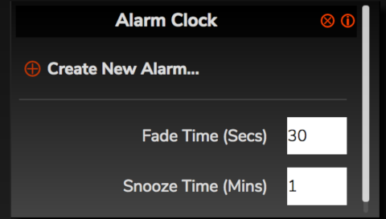
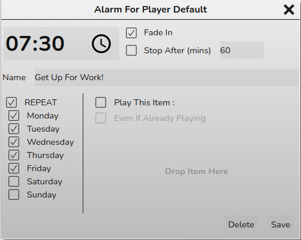
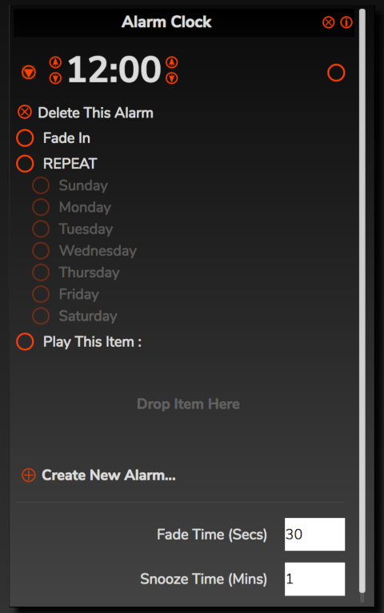
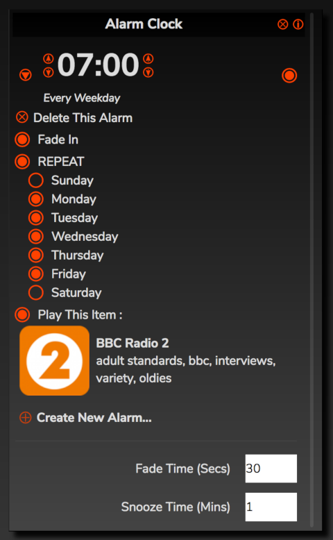
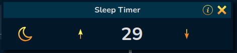

# Alarm Clock

The alarm clock will make RompЯ start playing music at a specified time of day. You can create multiple alarms with different properties.

When you first open the Alarm Clock panel it will  look like this

## Creating Alarms

The initial alarm is set to a time of 00:00 and has one button on the right, which is the edit button. Clicking the Edit button
opens the Alarm Editor

* You can set the time using the time editor. How this looks and works will depend on your browser.

* Fade In makes the volume slowly ramp up from 0 to the level you left it set at, over the course of the time specified as
Fade Time in the Alarms panel.

* Stop After makes the alarm automatically stop after the specified number of minutes.

* You can give the alarm a name if you want, to remind yourself what to do when it goes off. This is optional.

* REPEAT means the alarm will automatically go off at the set time on the specified days.
If you do not enable REPEAT then the alarm will go off once, at the specified time, and then disable itself.

* You can choose what you want the alarm to play by dragging it to the panel on 'Drop Item Here' and enabling 'Play This Item'.
This could be an album, a playlist, a radio station - anything from the sources (except Personalised Radio, currently).
If you don't choose an item then the alarm will play whatever is in the Play Queue when it goes off. If there is nothing
in the play queue RompR will start playing tracks from your Music Collection at random.

* Normally, if the Player is playing something at the alarm time, the alarm will not do anything except show a notification in the UI.
But if you select an item to play and enable 'Even If Already Playing' then the alarm will interrupt whatever is playing at the time
and play your chosen item. This can be useful for making RompR automatically play your favourite radio shows when they're on, for example.

When you've finished editing, click 'Save'. This will Enable the Alarm, and back in the Alarms panel you will now see it has
appeared as a new entry with a new icon at the top right. This is the Alarm Enable icon. When it is highlighted, as it is in this image,
the alarm is Enabled and will go off at the specified time. You can toggle the Enabled status of the alarm by clicking that icon.

Note that you can also edit the time for an alarm directly from the Alarms panel, without needing to open the editor.

### Note for MPD Users

If you choose Fade In, but playback is stopped (not paused, but actually stopped) when the alarm starts, RompR will not know
what volume to fade up to, because MPD does not report a volume when playback is stopped. In this case RompR wil fade the volume
up to maximum.

This does not apply to Mopidy, which always reports the volume correctly.

## Cancelling Alarms and Snoozing

When an alarm goes off, we refer to this as the alarm is Running. You'll get a notification panel at the top of the window.

At this point:

* Pressing Pause will snooze the alarm for the time specified as Snooze Time in the Alarms Panel
* Pressing Stop will stop the alarm Running, and also stop playback.
* Clicking the Alarm Enable icon (which will be spinning round), or the Alarm icon in the notification, will stop the alarm
Running but will not stop Playback.
* When the alarm is no longer Running, this will remove the notification and make Pause work like normal Pause again -
ie it will no longer snooze the alarm.

## Important Points

* When you create an Alarm, you are creating it to run *only* on whichever [Player](/RompR/Using-Multiple-Players) the browser
is currently connected to. You will only be able to view Alarms that are created on the Player you are connected to.
Each Player has its own set of Alarms.

# Sleep Timer

The Sleep Timer makes RompЯ pause playback after a specified number of minutes.

Set the number of minutes, and click ON. You can also specify a keyboard shortcut for the sleep timer from the Configuration panel.

When it activates, the sleep timer will slowly fade the music out before it pauses.

