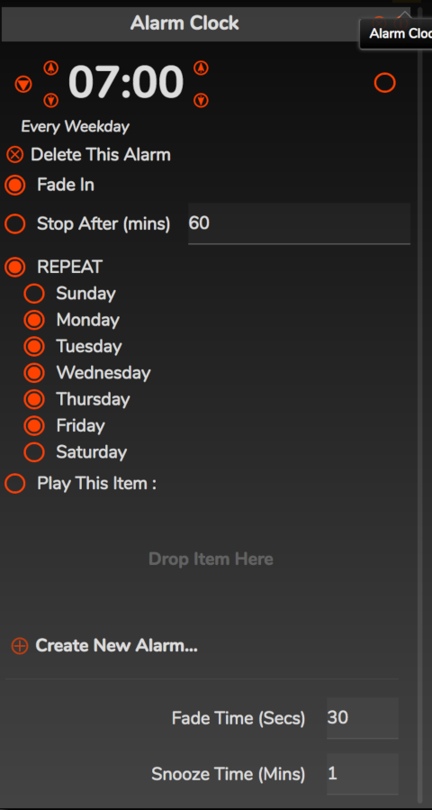
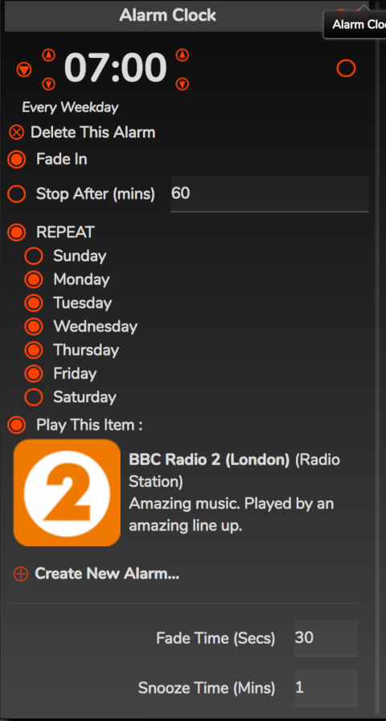

# Alarm Clock

The alarm clock will make RompЯ start playing music at a specified time of day. You can create multiple alarms with different properties.

When you first open the Alarm Clock panel it will  look like this

## Creating Alarms

To create an alarm, click the + next to 'Create New Alarm' ...

... and then click the triangle to edit the new alarm

* You can change the time with the up/down arrows. To enable the alarm, use the button on the right.

* Fade In makes the volume slowly ramp up over the number of seconds specified by 'Fade Time' at the bottom of the panel

* Stop After makes the alarm automatically stop after the specified number of minutes

* REPEAT means the alarm will automatically go off at the set time on the specified days. If you do not enable REPEAT then the alarm will go off once, at the specified time, and then disable itself.

* You can choose what you want the alarm to play by dragging it to the panel on 'Drop Item Here'. This could be an album, a playlist, a radio station - anything from the sources (except Personalised Radio, currently). If you don't choose an item then the alarm will play whatever is in the Play Queue when it goes off.

Here's an example alarm that wakes me up for work every weekday morning by playing Radio 2

## Cancelling Alarms and Snoozing

When an alarm goes off, you'll get a notification panel at the top of the window

At this point:

* Pressing 'Pause' or 'Stop' will SNOOZE the alarm.
* To cancel the alarm, click on the alarm clock icon in the notification.
* No further alarms will go off until the currentl alarm has been cancelled

## Important Points

* The alarm will play on whichever [Player](/RompR/Using-Multiple-Players) the browser is currently connected to.

# Sleep Timer

The Sleep Timer makes RompЯ pause playback after a specified number of minutes.

Set the number of minutes, and click ON. You can also specify a keyboard shortcut for the sleep timer from the Configuration panel.

When it activates, the sleep timer will slowly fade the music out before it pauses.

