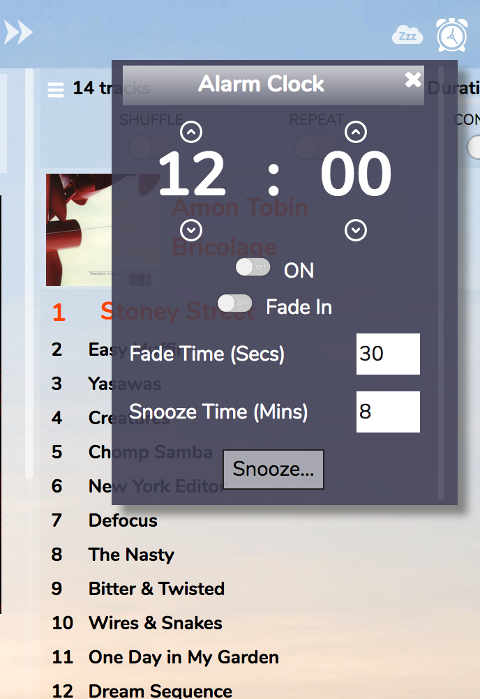

# Alarm Clock

The alarm clock will make RompЯ start playing music at a specified time of day.

You'll need to queue up some music, radio station, or whatever in the Current Playlist first. Then set the time you want the alarm to activate and select ON.

Fade In will make the volume slowly ramp up over the specified nuber of seconds.

Snooze will pause the music for the specified number of minutes. You can also assign a keyboard shortcut to Snooze from the Configuration panel.

The Alarm Clock is not available when using the Phone skin, as it will not activate if your device sleeps. If you're using the alarm clock on a laptop or desktop you should make sure the computer does not go into sleep or hibernate automatically.

# Sleep Timer

The Sleep Timer makes RompЯ pause playback after a specified number of minutes.

Set the number of minutes, and click ON. You can also specify a keyboard shortcut for the sleep timer from the Configuration panel.

When it activates, the sleep timer will slowly fade the music out before it pauses.

The sleep timer also is not available on the Phone skin.
