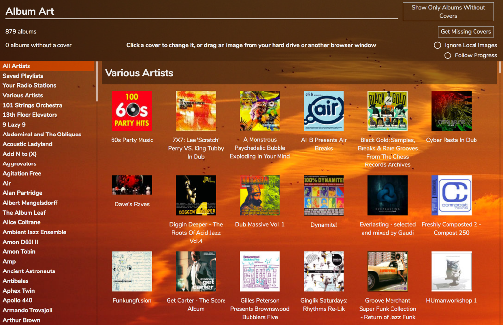
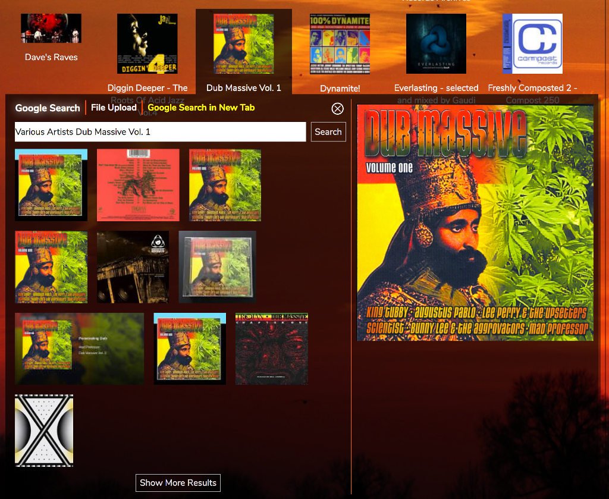

# The Album Art Manager

By default RompЯ will attempt to download album art for albums in your Collection or for those that come up in a search. If it fails to find anything or you'd like to change the art for some albums you can use the Album Art Manager.

This should be fairly self-explanatory.

* 'Get Missing Covers' will attempt to find covers for any albums that don't have one.
* 'Ignore Local Images' will force Rompr to download all album art fomr online sources, even if local images are available
* 'Follow Progress' will make the display auto-scroll to the cover currently being downloaded

To manually change the cover for an album you can:

* Drag an image from your hard drive or another browser window directly onto the cover in the Album Art Manager.
* Click on the image to open the image selector.

By default the image selector opens a Google Images search (but see below!). You can change the search term and click 'Search' to try something else. You can use 'File Upload' to select a local file. 'Google Search In New Tab' will open a new browser tab on Google Images with the current search term.

## Using Local Images

For local music files you may already have album art stored alongside those files or embedded in them. RompЯ can access this IF your webserver is running on the same computer as where you music files are stored.

First, go to the Configuration panel and enter the full path to your music in the text box under 'Album Art'. This MUST match the Local Folders configuration setting in your mpd.conf or mopidy.conf.

Now when RompЯ searches for album art it will use your local images in preference. If you have lots of local images for an album the image selector will allow you to choose between them.

_Note: this setting only works if you're using MPD, or Mopidy's local backend. Other mopidy backends that play local files (eg beets) will not work_

## Getting Album Images from Mopidy

Mopidy can serve Album Art for most of the backends it supports - including Local Files. You do not need to set the path to your music, nor does your webserver have to be on the same machine as your music or as mopidy.

However you need to have Mopidy's HTTP frontend enabled and working correctly as described [here](/RompR/Rompr-And-Mopidy)

## Getting Album Images from MPD

If you have MPD version 0.22.4 or greater RompR will use MPD to scan your files for artwork. You do not need to set the path to your music, nor does your webserver have to be on the same machine as your music or as mpd.

## Using individual images for different tracks

This is quite niche but there is the occasional album where there are different images for each track. Under the drop down menu next to every album there is an option to 'Scan each track for an image'.
If you select this option RompR will try to use the separate image for each track. This requires either your local music path to be set as above, or for you to be using MPD 0.22.4 or higher.

### Archiving Local Images

Once you've downloaded all the art for your Collection, you can archive the images for your local files if you have set the path correctly as above. This is a manual step and requires a terminal open on the PC where your webserver runs.

    cd /PATH/TO/ROMPR
    cd utils
    php ./archiveimages.php

This will copy RompЯ's images into your Local Music folders.

### Using Bing Image Search To Find Album Art

This version of RompR now uses Bing instead of Google to search for Album Art. To use this functionality you'll need to sign up for a Free Azure account, enable the
Bing Search v7 functionality, then create an API key and enter it into the setup screen you access from /rompr?setup on your RompR installtion. I could try and describe
how you do this but it changes a lot so my docs would quickly go out of date. Instead I would start here https://docs.microsoft.com/en-us/bing/search-apis/bing-image-search/overview
and once you have a subscription key you're good to go.

The switch from Google to Microsoft is likely to raise a few eyebrows, so here is the reasoning.

* The existing Google Search code broke when Google made a change to their terms of service, the details of which were buried deep in a 1000-word email of the type that nobody ever reads.
* This pised me off enormously, and I went to try to find out how it works now and spent a fruitless couple of hours trying to get Google's docs to make sense.
* Google's API is hugely complex and difficult to get to grips with, their documentation is a very good example of how to write extremely bad documentation, and the layout of Google's developer portal was designed by a maniac with ADHD. I hate every single thing about it.
* Bing's API is straightforward, the documentation is good, and the data it returns is much more comprehensive than Google's. The layout of the developer portal is still awful, but it's not as bad as Google's.
* I had Bing search working within 30 minutes of signing up, including writing code. That's really all that matters in the end.

It's come to something when Microsoft are providing a better service than Google, but hey-ho, times change. Google are the new Microsoft. Microsoft are the new Google.

Note that you will eventually have to "Upgrade" to a Pay-As-You go plan on Azure, but the only API RompR uses is currently free so should not cost you anything.
By entering any information relating to your Azure account into RompR you are agreeing that the developers of RompR are not responsible if you end up paying anything for your Azure account.
Sorry to have to say that, but some people are dicks.