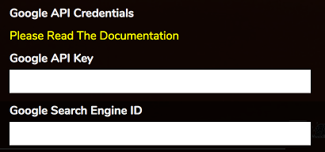

# The Album Art Manager

By default RompЯ will attempt to download album art for albums in your Collection or for those that come up in a search. If it fails to find anything or you'd like to change the art for some albums you can use the Album Art Manager.

This should be fairly self-explanatory.

* 'Get Missing Covers' will attempt to find covers for any albums that don't have one.
* 'Ignore Local Images' will force Rompr to download all album art fomr online sources, even if local images are available
* 'Follow Progress' will make the display auto-scroll to the cover currently being downloaded

To manually change the cover for an album you can:

* Drag an image from your hard drive or another browser window directly onto the cover in the Album Art Manager.
* Click on the image to open the image selector.

By default the image selector opens a Google Images search (but see below!). You can change the search term and click 'Search' to try something else. You can use 'File Upload' to select a local file. 'Google Search In New Tab' will open a new browser tab on Google Images with the current search term.

## Using Local Images

For local music files you may already have album art stored alongside those files or embedded in them. RompЯ can access this IF your webserver is running on the same computer as where you music files are stored.

First, go to the Configuration panel and enter the full path to your music in the text box under 'Album Art'. This MUST match the Local Folders configuration setting in your mpd.conf or mopidy.conf.

Now when RompЯ searches for album art it will use your local images in preference. If you have lots of local images for an album the image selector will allow you to choose between them.

_Note: this setting only works if you're using MPD, or Mopidy's local backend. Other mopidy backends that play local files (eg beets) will not work_

## Getting Album Images from Mopidy

Mopidy can serve Album Art for most of the backends it supports - including Local Files. You do not need to set the path to your music, nor does your webserver have to be on the same machine as your music or as mopidy.

However you need to have Mopidy's HTTP frontend enabled and working correctly as described [here](/RompR/Rompr-And-Mopidy)

### Archiving Local Images

Once you've downloaded all the art for your Collection, you can archive the images for your local files if you have set the path correctly as above. This is a manual step and requires a terminal open on the PC where your webserver runs.

    cd /PATH/TO/ROMPR
    cd utils
    php ./archiveimages.php

This will copy RompЯ's images into your Local Music folders.

### Using Google Images To Find Album Art

#### Everything below here is now Wrong
Google change how this works every six months and the Google Developer site is completely unintelligible to people whose brains work like normal people, so I'm
no longer supporting this because I cannot be bothered to update the code and documentation on such a frequent basis. Fuck Google.

if anybody cares to figure out how to make this work again, feel free to write a forum post about it.

RompЯ is capable of searching Google Images for album art. However, Google Images only allow 100 free queries per day, and charge for anything more than that. In the past I have generously increased the limit to 1000 queries per day and paid for the (very small) use this gets out of my own pocket. Unfortunately, some days ago, some nefarious person or persons have hijacked my Google API key (which is published in the code) and started using it for their own purposes, racking up a substantial bill which I had to pay. So from now on if you wish to use Google Images to search for album art you will have to provide your own API key. This is free for up to 100 searches a day. If you wish to use more than that you can choose to limit the amount of searches per day to stop you overspending. The process for setting this up is described below. It is slightly complicated unfortunately.

The API key is also required if you want to use the Youtube Information panel to get Artist videos.

First you will need a Google Account if you don't already have one. Sign up at [Google](https://www.google.com).

#### Create Your Google API Key

Sign in to Google then go to [Google Developers](https://developers.google.com/). At the bottom of the page click 'Google API Console'.

Next you must create a Project. There should be a 'Create Project' button for this. Once you have created the project (you just need to supply a name, which can be anything) you will be returned to the Dashboard.

Click 'Enable APIs and Services' and then search for 'Custom Search API' and enable it.

Now you need to create credentials (this is your API key). Click 'Create credentials'. Then click 'What credentials do I need?' and you will be provided with an API key. Copy this value to the 'Google API Key' box in the setup screen you reach by going to rompr?setup in your browser

**NOTE: Someties Google puts spaces at the start or end of the API Key when you copy it to the clipboard. You MUST remove these or the key will not work - check the value you have pasted into the setup screen carefully and remove any spaces from the beginning or end**

Click 'Done' on the Google API Webpage..

Now, you need to create a Custom Search Engine

#### Create Your Custom Search Engine

Go to [Google Custom Search](https://cse.google.com/cse/all) and click 'Add'.

Under 'Sites To Search', enter *.google. Then click 'Create'.

You will be returned to CSE Home. Now click 'Control Panel' next to 'Modify Your Search Engine'. Make sure 'Image search' is ON. Next to 'Sites To Search' select 'Search the entire web but emphasize included sites'. Now click on 'Search Engine ID' and copy the value into the box on the setup screen.

**NOTE: Someties Google puts spaces at the start or end of the Search Engine ID when you copy it to the clipboard. You MUST remove these or the key will not work - check the value you have pasted into the setup screen carefully and remove any spaces from the beginning or end**

Click 'Update' on the Google CSE webpage.

Click 'OK' on Rompr's setup screen.
