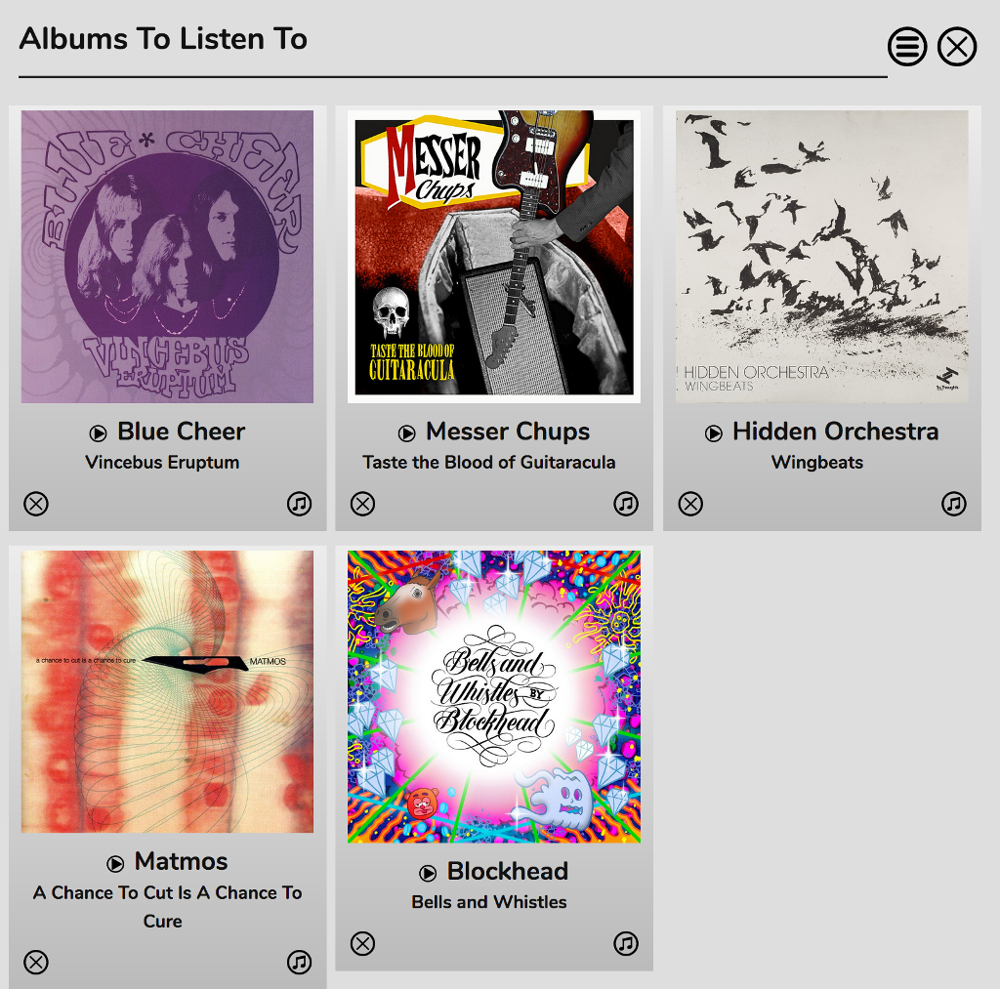

# Albums To Listen To

The Albums To Listen To plugin is a place where you can keep a record of Spotify albums you have seen and are interested in hearing.

You can add albums to this list from the [Spotify Info Panel](/RompR/The-Info-Panel). You can then come back and listen at your leisure.

If you have Mopidy with Spotify support (currently not working) Albums and tracks can be added to the Play Queue directly from this list and you can click the musical notes icon either under the album or next to it in the Play Queue.

If you decide you don't like it, just click the x to remove it from the list.

All of the albums can be expanded to show a full track listing and a biography of the artist.

Albums To Listen To is different from The Wishlist. The Wishlist contains a list of tracks you heard on the radio that you wanted in your Music Collection but which could *not* be located on Spotify. Albums To Listen To contains albums that *are* on Spotify that you've not yet decided you want in your Music Collection.
