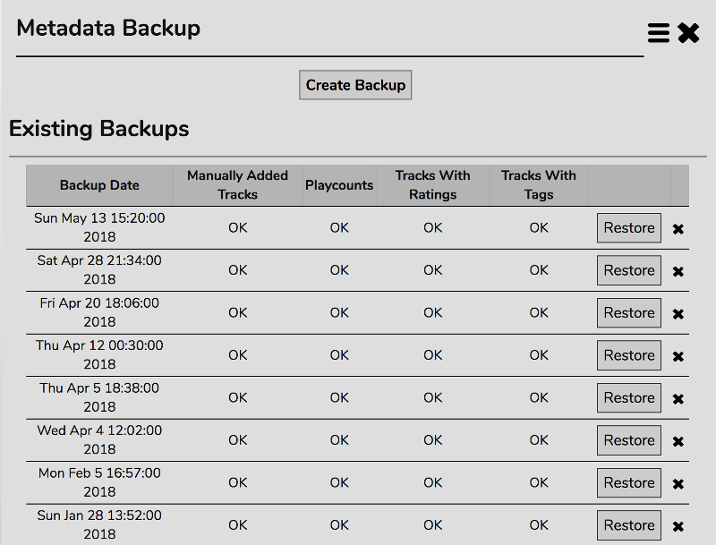

# Backing Up Your Metadata

You may wish to keep a backup of all your Collection metadata - Tags, Ratings, Playcounts, and Manually Added Tracks. The 'Metadata Backup' panel allows you to this.

Click 'Create Backup' to create a new backup.

Click 'Restore' to restore the selected backup.

Click the X to delete a backup.

## Transferring Metadata

You may want to transfer your metadata from one install to another. Perhaps you're setting up a new installtion of RompЯ or you're recreating your collection. You can do this, even if your local files are stored under a different directory structure.

You'll need to copy the backup data from the old installation to the new one. It is stored in

    rompr/prefs/databackups/
    
In there will be a separate, dated directory for each backup. Simply copy the folder you want, open RompЯ, and click 'Restore'.
