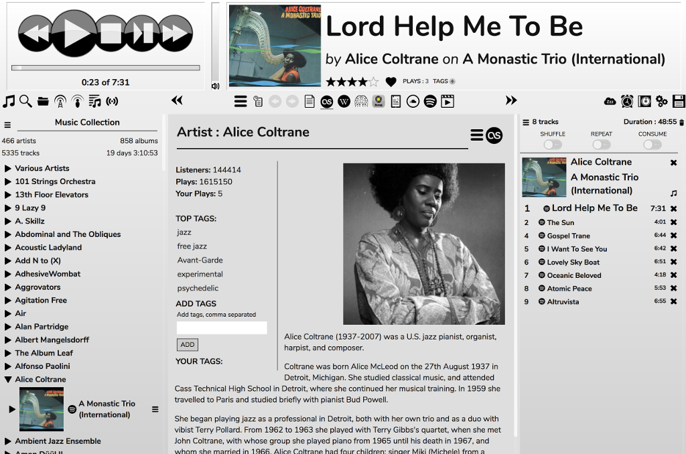

# The Desktop Skin

The Desktop skin is the default if you're accessing RompЯ from a browser on a desktop computer or laptop.

At the top left are the play controls. These are (left to right)
* Previous Track
* Play/Pause
* Stop
* Stop After Current Track
* Next Track

Next to those is a vertical slider which is the volume control. The icon underneath it is a mute button when you're using Mopidy or using mpd with only one audio output. When you're using mpd with multiple audio outputs this button opens a menu allowing you to enable or disable the outputs.

Next to those is the Now Playing panel. This shows information about the currently playing track - the album image, track title, album name, and artist. Also the Rating, Tags, Playcount, and a Last.FM 'Love' button if you're [logged in to Last.FM](/RompR/LastFM).

Underneath that on the left is the Music Sources panel. You choose different sources using the icons at the top. These are (left to right):
* [Music Collection](/RompR/Music-Collection)
* [Search](/RompR/Searching-For-Music)
* File Browser
* [Internet Radio](/RompR/Internet-Radio)
* [Podcasts](/RompR/Podcasts)
* [Saved Playlists](/RompR/Using-Saved-Playlists)
* [Personalised Radio](/RompR/Personalised-Radio)

In the centre is the Info Panel. The icons across the top are (left to right)
* Open Drop-Down-Menu of plugins - this is where things like the Ratings and Tags manager, Playlist Manager, etc can be found
* History
* Back (Info Panel)
* Forward (Info Panel)
* Collection Information
* Last.FM Info
* Wikipedia
* Musicbrainz
* Discogs
* Lyrics
* Soundcloud
* Spotify
* Youtube

On the right-hand side is the Play Queue. Above that are various tools. These are (left to right):
* [Sleep Timer](/RompR/Alarm-And-Sleep)
* [Alarm Clock](/RompR/Alarm-And-Sleep)
* [Album Art Manager](/RompR/Album-Art-Manager)
* Configuration Menu
* Save Play Queue as a Playlist

The lower panels can be resized by dragging their edges, or hidden using the 'double arrow' icons.
On a touch device you can resize the panels by pinching inside them with 2 fingers.
