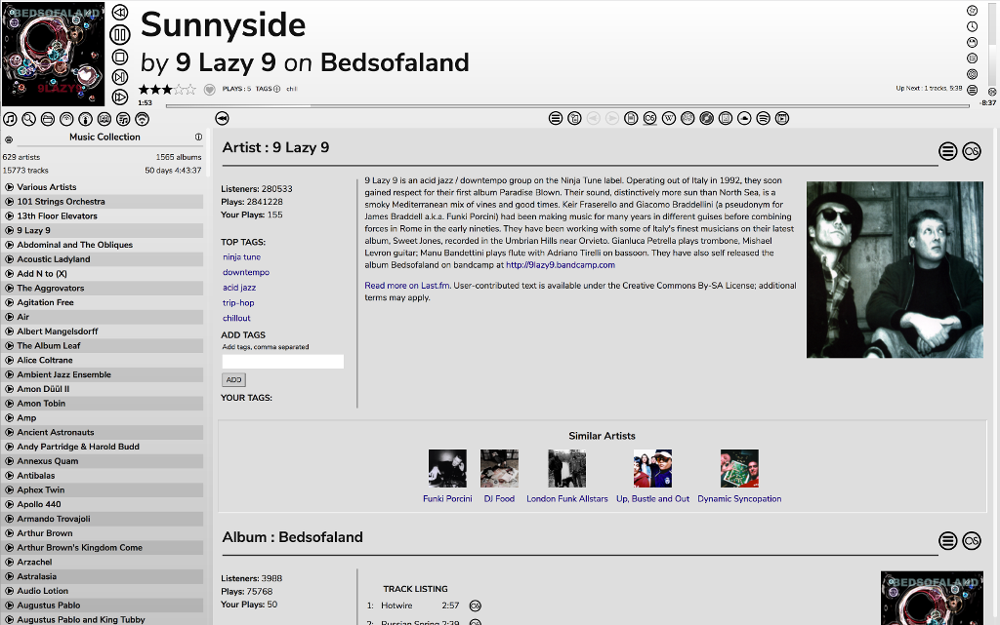
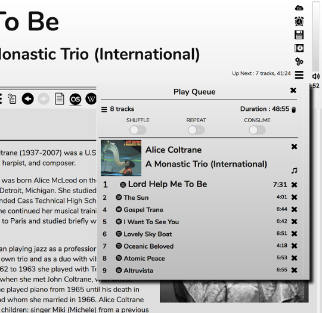

# The Fruit Skin

Why Fruit? I suck at making up names, that's why. The Fruit skin is an alternative skin aimed at desktop/laptop browsers. It gives more space to the Info panel by moving the Play Queue to a dropdown menu.

The Play Queue can be opened from the 'hamburger' icon by the volume control, next to which there is an 'Up Next' display.

The Play Queue will remain open until you click the 'hamburger' again or click the x next to the title, meaning you can still use drag-and-drop to add items to it or rearrange the items in it. It can also be 'torn off' and placed elsewhere by dragging anywhere on the title.
