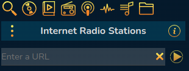
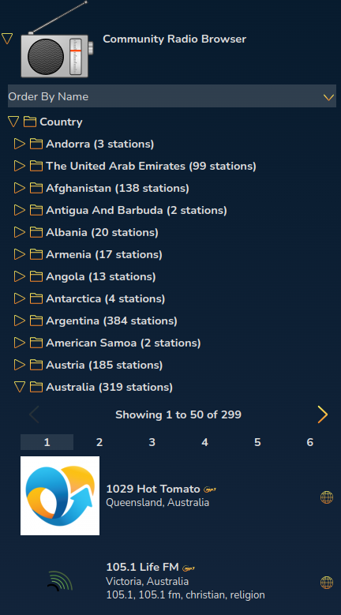

# Internet Radio

The Internet Radio Stations panel allows you to play radio stations from a variety of online sources.

## Adding a URL

If you know the URL of the radio stream you want to play you can addit directly to the Play Queue by entering it into the box you will open
if you click the 3 dots icon at the top left

## Your Radio Stations

This is a list of Favourite radio stations. It can be re-ordered by dragging items up and down.

You can add stations to this list by clicking the Radio Tower icon in the Play Queue while the station is playing.

## Soma FM

[Soma FM](https://somafm.com/) is a listener-supported, commercial-free radio station from San Francisco. If you like the stations it offers, please support the station by donating or buying merchandise as they rely entirely on your support to keep going.

You'll be given a list of stations. Before you can play a station for the first time you need to choose a stream quality. 'Highest Available Quality' will
always work unless you have a limited bandwitdh connection, in which case chose one of the other settings. Not all stations support all quality settings.

## TuneIn Radio Directory

This is a directory of international radio stations and podcasts.

There is a browseable list of categories and a search box.

Double-click a Radio Station or Podcast in this list to listen to it.

## Community Radio Browser

This uses the radio directory at [http://www.radio-browser.info/](http://www.radio-browser.info)

You can change the order of the list by using the Order By menu at the top.

## Icecast Radio

Icecast is an open-source alternative to ShoutCast.

Note that while Rompr will allow you to add IceCast stations to Your Radio Stations, the URLs for the stations have a habit of changing and this will make your favourites stop working. There's nothing I can do about this - you'll have to remove the favourite and search for it again. Or find it in one of the other radio panels.

Icecast does not have a 'broswer' panel, because its API really sucks. It will provide seacrh results when you use the search panel.