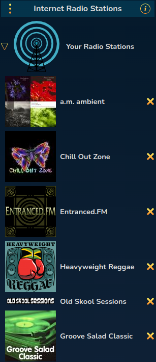
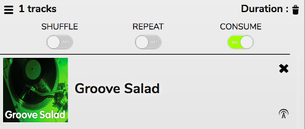
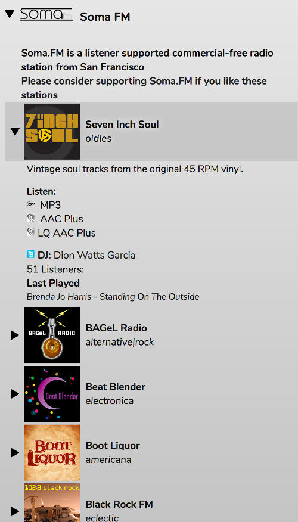
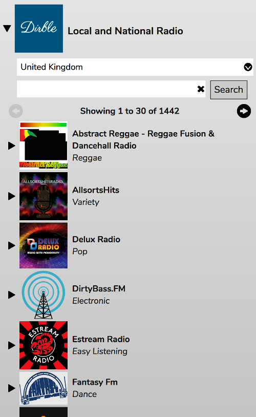
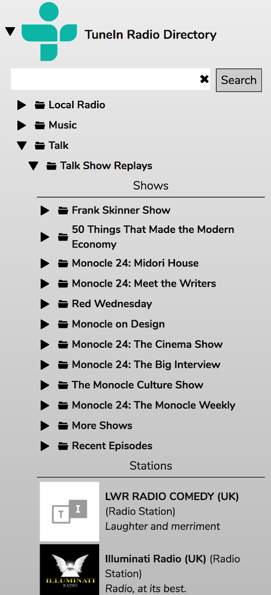
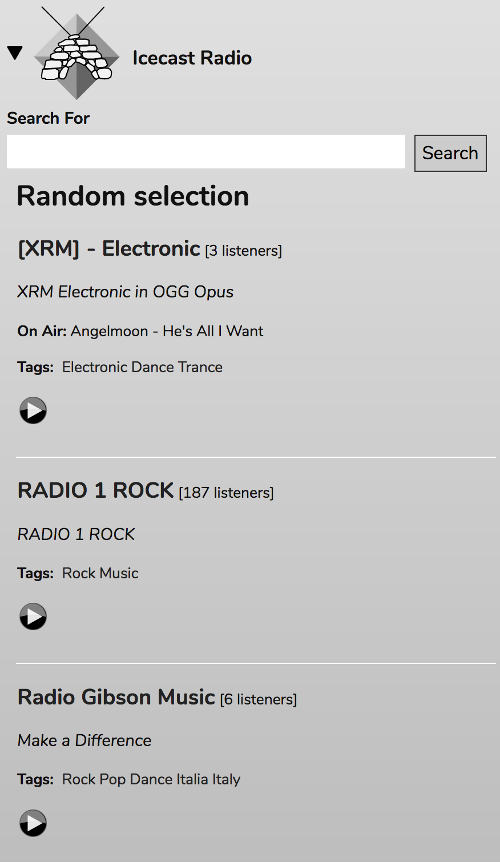

# Internet Radio

The Internet Radio Stations panel allows you to play radio stations from a variety of online sources.

## Your Radio Stations

This is a list of Favourite radio stations. It can be re-ordered by dragging items up and down. You can add stations to this list by clicking the Radio Tower icon in the Current Playlist while the station is playing.

## Soma FM

[Soma FM](https://somafm.com/) is a listener-supported, commercial-free radio station from San Francisco. If you like the stations it offers, please support the station by donating or buying merchandise as they rely entirely on your support to keep going.

You'll be given a list of stations. You can play a station's highest quality stream just by double-clicking the station name. Opening up the station will give you more information as well as choice of streams in order of quality (highest quality first, lowest bandwidth last).

## Local and National Radio

This section uses the Dirble online radio directory to search thousands of radio stations.

From the dropdown menu at the top you can select a country or genre.

The Search panel will search for the terms you enter *within the country or genre*.

As with Soma FM, you can play a station just by double-clicking the station name. Opening up the station will give you more information as well as choice of streams.

## TuneIn Radio Directory

This is a directory of international radio stations and podcasts.

There is a browseable list of categories and a search box.

Double-click a Radio Station or Podcast in this list to listen to it.

## Icecast Radio

Icecast is an open-source alternative to ShoutCast.

