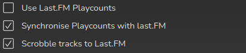

# Keeping Playcounts In Sync Across Devices

RompR keeps Playcounts for everything you play through it. But most people don't only listen to music using RompR. If you listen to music on your phone, or at work, then those plays won't be counted by RompR. So how can you keep them in sync?

You can use [Last.FM](/RompR/LastFM).

The first thing you need is a Last.FM account. Then you need to make sure you are Scrobbling from every device you use to listen to music. You can get Last.FM Scrobblers for most devices. For Spotify you don't even need an app, you just enable Spotify Scrobbling in your LastFM Account.

In your RompR setup you need to Log In to Last.FM and make sure you're scrobbling tracks from there too, or if you access RompR from a phone or tablet I reccomend you read [RompR and Mobiles](/RompR/Rompr-And-Mobiles)

Now you can enable some options to keep your Playcounts in Sync. There are two options, subtly different.

* Enabling 'Use LastFM Playcounts' will mean that, when you play a track in RompR, Rompr will fetch the number of Scrobbles for that track from Last.FM and update the Playcount in your Music Collection. It will only use the Last.FM Scrobble value if it is bigger than the Playcount value in your collection.

* Enabling 'Synchronise Playcounts with last.FM' works as follows: On a daily basis RompR will retrieve a list of everything you scrobbled to Last.FM since the last time RompR checked. For every scrobble, it will incrememnt RompR's playcount for that track by 1 - unless it was RompR that played that track, in which case the Playcount will not be incremented (because RompR will have done that when it played the track).

There's no harm in keeping both of these enabled; the first is of more use to people who have been using Last.FM for a long time and want to bring their Scrobbles into their RompR Collection. But there is also another way to do this.

You can use the 'Last.FM Playcount Importer' from the plugins menu. What this does is to go through *every track in your Collection* and see if it exists in your Last.FM library. If it does, RompR will use the Scrobble count from Last.FM to set the Playcount in your collection. People who have been using Last.FM for a time before starting to use RompR can use this to bring in all their Playcount information at the start, and then use the Synchronise option to keep everything in sync. Note though that this importer takes a *very long time* to run - several hours if you have a few thousand tracks in your Collection, and this is really why 'Use Last.FM Playcounts' exists - if you don't have the patience to run the Importer, you can use that option to bring your Playcounts in as you play tracks.

After you've run the importer once, if you run it again it will only import Scrobbles for tracks that have been added to the collection since you last ran the Importer.

It's all a little complicated isn't it? I've tried to provide lots of options to keep everyone happy so here's the way I imagine it being used.

* Someone who is a long-time user of Last.FM and wants to bring their Scrobbles into RompR as Playcounts, should first run the Importer then enable the Synchronise option.
* Someone who is a long-time user of Last.FM and wants to bring their Scorbbles into RompR as Playcounts, and who has tens of thousands of tracks in their Collection and really doesn't want to have to leave a computer running an Import for 24 hours, should use the "Use LastFm Playcounts" option, and the Synchronise option.
* Someone who has decided they want to use Last.FM to sync their Scrobbles and doesn't have any hisotrical data on Last.FM should just use the Synchronise option.

