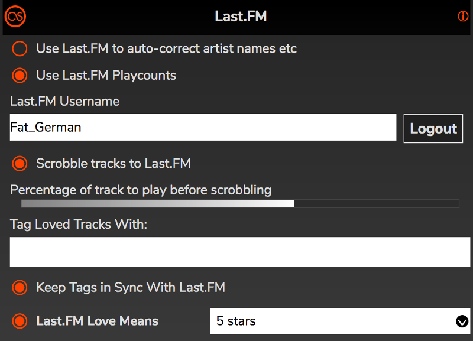

# Last.FM

If you have a Last.FM account, RompЯ will scrobble tracks to it and allow you to Love and add tags to tracks. If you use Mopidy-Spotify, Mopity-Youtube, or Mopidy-YTMusic you will also be able to use your scrobbles to [generate radio stations](/RompR/Music-Discovery) like the old Last.FM Mix radio.

Open the Configuration panel and go to the Last.FM section

Enter your Last.FM username and click Login, then follow the on-screen instructions.

You can enable Scrobbling from here, and set the percentage of a track that has to be played before RompЯ will scrobble it. This cannot be set lower than 50%, due to Last.FM rules.

You can use Last.FM to auto-correct artist names on tracks that are playing if you like. This helps ensure more consistent scrobbles.

There are a few options that allow you to use Scrobbles to synchronise your Playcounts when you play music on various devices. These are described under [Keeping Playcounts In Sync](/RompR/Keeping-Playcounts-In-Sync)

If you enter some text into 'Tag Loved Tracks With', then when you click the 'Love' button for a track that tag will automatically be added to it.

The other two options are described in more detail under [The Info Panel](/RompR/The-Info-Panel#lastfm)
