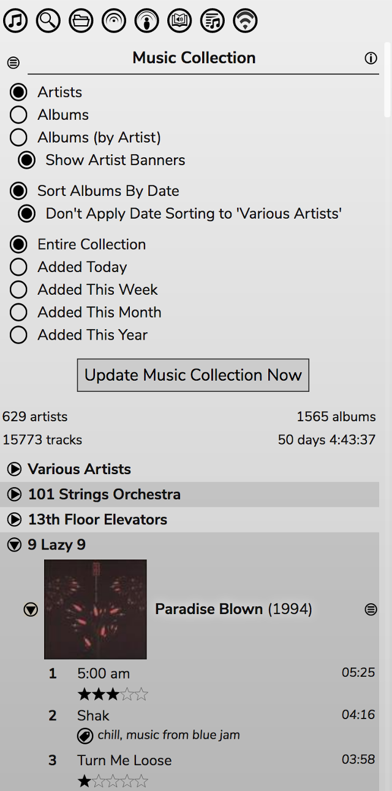

# The Music Collection
The Music Collection is the reason RompЯ exists. It was designed to sort your music by artist and album, even if they're scattered all over different folders, or even different Mopidy backends.

For mpd users. the Collection consists of your mpd library. For Mopidy users the Collection can be created from a combination of your Mopidy backends, and tracks can be added on the fly from Spotify, Soundcloud, and other online sources. With Mopidy it creates a complete list of all the music you listen to from any source, all sorted by artist and album, all in one place.

## Tagging And Rating
Tracks in the collection can be given a rating (from 1 to 5 stars) and arbitrary text tags. The tags and ratings will be shown in the Music Collection.

They will also be shown in the Now Playing area. To rate a track that is playing, just click on the stars. To add a tag click on the + sign. To remove a tag, hover over the tag and click the x that appears.

You can search for tags or ratings using the Search panel. You can also manage them and get a sorted list by using the 'Ratings and Tags' panel. Tags and ratings can also be used to generate dynamic playlists.

## Collection Sources

For Mopidy users, the Configuration panel gives you the choice of which Mopidy backends you want to use to build your collection. To get Spotify 'Your Music' and Your Spotify Artists you must be running the Mopidy-Spotify-Web backend as well as Mopidy-Spotify. Other Mopidy backends will also appear in this list if they are enabled in Mopidy.

Classical music lovers (or lovers of other genres) also have the option to sort by Composer for specific Genres. Note that this relies on tracks being tagged with Composer information, which is not always the case with some backends in Mopidy. For local files you will need to tag them yourself for this to work.

**After changing any of these options you must rebuild your Music Collection**

## On-The-Fly Collection Building
Mopidy users also have the option to add tracks to the collection as they play. If you're playing a track from, say, Spotify and you like it, just give it a tag or a rating and it will be automatically added to your collection. It will appear in the Collection with a cross next to it, which you can click to remove the track from the Collection.

If you're listening to an internet radio station and you hear a track you like, tagging or rating that will make RompЯ search for it on Spotify and add it to the collection if it finds it, or to your Wishlist if it doesn't.
