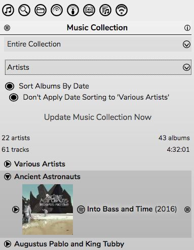
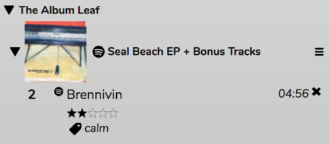
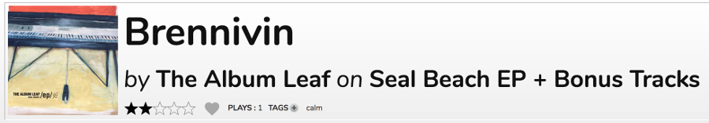
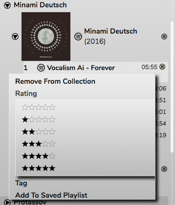
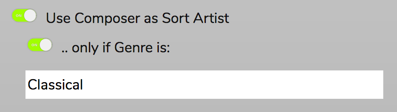

# The Music Collection

The Music Collection is the reason RompЯ exists. It was designed to sort your music by artist and album, even if they're not correctly tagged.

For mpd users. the Collection consists of your mpd library. For Mopidy users the Collection can be created from a combination of your Mopidy backends, and tracks can be added on the fly from Spotify, Soundcloud, and other online sources. With Mopidy it creates a complete list of all the music you listen to from any source, all sorted by artist and album, all in one place.

You can choose to display the collection sorted by

* Artist (in alphabetical order)
* Album (in alphabetical or date order)
* Albums (by Artist) - displays all albums at once sorted first by Artist, then either alphabetically or by date
* Rating - sorts your Collection by Rating first, album second. Only rated tracks will be shown.
* Tag - sorts your Collection by Tag first, album second. Only tagged tracks will be shown.

You can choose not to apply Date Sorting to 'Various Artists' - where sorting albums alphabetically is almost always more useful.

You can choose also to only display tracks and albums that were added within a specific time period (today, this week, this month, or this year)

## Tagging And Rating

Tracks in the collection can be given a rating (from 1 to 5 stars) and arbitrary text tags. The tags and ratings will be shown in the Music Collection.

They will also be shown in the Now Playing area.

To rate a track that is playing, just click on the stars in the Now Playing panel. To add a tag click on the + sign. To remove a tag, hover over the tag and click the x that appears.

You can also add tags and ratings from the File [information panel](/RompR/The-Info-Panel).

You can search for tags or ratings using the [Search Panel](/RompR/Searching-For-Music).

Tags and ratings can also be used to generate [Personalised Radio](/RompR/Personalised-Radio).

## Selecting tracks

To play a track in one of the Desktop skins, double-click it. This will add it to the [Play Queue](/RompR/The-Playlist). In the Phone and Tablet skins, this is accomplished with a single-click.

The 'Click Mode' can be changed from the Preferences pane.

In Double-Click mode, clicking once on a track will select it. You can select multiple tracks by holding down Ctrl (Cmd on macOS), or Shift - which will select a range of tracks. A selection can be dragged to the Play Queue. Selected tracks will also display a '+' icon from which you can get a menu which allows you to Rate, Tag, or add tracks to a [Saved Playlist](/RompR/Using-Saved-Playlists)

When you use this to add Ratings, Tags, or to Playlists it will apply to *all selected tracks*.

In Single-Click mode, the + icon will always be visible. Clicking the icon will show the menu and will also select the track. Clicking the icon on further tracks will add them to the selection. Clicking it again will remove them from the selection.

## Collection Sources (Mopidy Only)

For Mopidy users, the Configuration panel gives you the choice of which Mopidy backends you want to use to build your collection.

You will only see options for backends that are enabled in Mopidy. The complete list of supported backends is:

* **Local Music** [('local' backend must be enabled)](/RompR/Rompr-And-Mopidy)
* **Beets** [('beets' backend must be enabled)](/RompR/Rompr-And-Mopidy)
* **Beets Local** ('beetslocal' backend must be enabled)
* **Spotify Playlists** ('spotify' backend must be enabled, and must be version 4.0 or greater) *This will add all tracks from your Spotify Playlists into your collection. Your playlists will still be available as Playlists even if you don't select this option*
* **Spotify 'Your Tracks'** ('spotify' backend must be enabled, and must be version 4.0 or greater)
* **Spotify 'Your Albums'** ('spotify' backend must be enabled, and must be version 4.0 or greater)
* **Google Music** ('gmusic' backend must be enabled)
* **SoundCloud 'Liked'** ('soundcloud' backend must be enabled)
* **SoundCloud 'Sets'** ('soundcloud' backend must be enabled)
* **SoundCloud 'Stream'** ('soundcloud' backend must be enabled)
* **VKontakte** ('vkontakte' backend must be enabled)

### On-The-Fly Collection Building

Mopidy users also have the option to add tracks to the collection as they play. If you're playing a track from, say, Spotify and you like it, just give it a tag or a rating and it will be automatically added to your Collection. Tracks added this way can be removed using the hamburger icon menu. Spotify albums from the [Current Playlist](/RompR/The-Playlist), the [Spotify Info Panel](/RompR/The-Info-Panel), and [Music Discovery Sources](/RompR/Music-Discovery) can also be added directly into the Music Collection.

If you're listening to an internet radio station and you hear a track you like, tagging or rating that will make RompЯ search for it on Spotify and add it to the collection if it finds it, or to your [Wishlist](/RompR/The-Wishlist) if it doesn't.

### Preferring Local Music

This option is best explained by an example. Suppose you have added some tracks from Spotify into your Music Collection on-the-fly but you then decide you'd like to buy copies of those files and add them to your local music in Mopidy. Normally, Rompr regards albums from different sources as different albums, so if you udate your Music Collection you'll have 2 copies of the album - one from Spotify and one Local. However, if you enable 'Prefer Local Music to Internet Sources', the pre-existing Spotify album will be replaced with your new Local album, and all ratings, tags, and playcounts transferred to it.

Note that if the album exists in your Spotify Playlists or 'Your Music' and you are building your Collection from those sources, it will remain in your Collection. The replacement option only applies to files that have been added on the fly.

## Composers

Classical music lovers (or lovers of other genres) also have the option to sort by Composer for specific Genres. Note that this relies on tracks being tagged with Composer information, which is not always the case with some backends in Mopidy. For local files you will need to tag them yourself for this to work.

