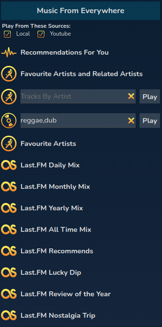

# Music Discovery

RompЯ contains many features to help you discover new music based on your listening habits. These will work best if you are using RompЯ with Mopidy and an onlue music source such as Youtube Music and I'll be assuming that is the case. If you don't have this then you can still get suggestions of albums you might like but you will not be able to add tracks to the play queue.

## More Personalised Radio

The Personalised Radio panel includes more radio stations designed to help you discover music. These are only available if you're using Mopidy
with Spotify, Youtube, or YTMusic.

### Use of Your Data

Note that when you use 'Recommendations For You', 'Favourite Artists and Related Artists', or any of the 'Music From Spotify'
stations, RompR will send information about your listening habits to Spotify's API. There is no information sent that could be used
to identify you personally except perhaps your IP address. The information is limited to only the Spotify IDs of artists and tracks
that you have listened to using RompR. This happens whether or not your player has Spotify support enabled.

### Music From Spotify

The three Music From Spotify stations use your listening habits from RompR's database to generate playlists of music based on tracks you've played
recently (Weekly Mix and Swim) or your most-played tracks (Surprise!).

In the Spotify Info Panel you will also be able to start a radio station of recommendations based on the Artist you're listening to, the Track you're
listening ot (if it's a Spotify track) or sometimes on the Artists Genres - but Spotify only permits certain Genres to be used in this way.

### Music From Everywhere

This panel allows you to make use of all your Mopidy sources - Soundcloud, Youtube, Youtube Music, etc to create playlists.

Recommendations For You uses your Favourite Artists as determined by your RompR playcounts and then uses Spotify's API to get recommended tracks based on
those artists. This does not require Mopidy-Spotify to be enabled.

Favourite Artists and Related Artists will play a selection of tracks by artists determined to be your Favourites based on your listening habits as well as
Artists that are 'Related'. RompR uses your RompR playcounts to determine your favourite artists, and it used Spotify's API to get related artists.
This does not require Mopidy-Spotify to be enabled.

Tracks by Artist will play a random selection of tracks by the artist you enter.

In Genre you can enter up to 5 genres separated by commas. RompR uses Spotify's APIto get tracks based on those genres.
This does not require Mopidy-Spotify to be enabled.

The Last.FM stations require you to be [logged in to Last.FM](/RompR/LastFM).
They use your Last.FM scrobbles and Last.FM's suggestion engine to create playlists based on your listening over the past week, month, year, or all time.
'Lucky Dip' may produce a more varied selection than 'Mix'.

### Note on Mopidy-YTMusic and Mopidy-Youtube

The Music From Everywhere stations will search your Mopidy sources for music to play.

If you're using Mopidy-YTMusic and you're not a paid subscriber it wil work but some tracks will not play.

If you're using Mopidy-Youtube these stations work best if you enable the Music API. See the Mopidy-Youtube documentation for how to do that.

## Listening to the Radio

When listening to internet radio, if the station you're listening to provides Artist and Title information, this will be displayed in the now-playing panel.
If you hear a track you like you can give it rating or a tag.
RompЯ will then search for it using your Mopidy backends and will add it into your collection if it finds it.
It the track is already in your collection, the rating or tag will be added to that track instead.

If the track can't be found it will be added to your [Wishlist](/RompR/The-Wishlist)

## The Info Panel

Mopidy-Spotify users can get more suggestions about new music related to the currently playing track by using the Spotify [Info Panel](/RompR/The-Info-Panel)
