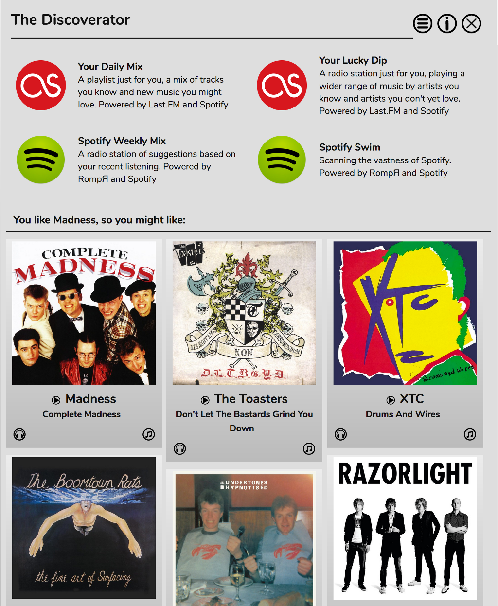
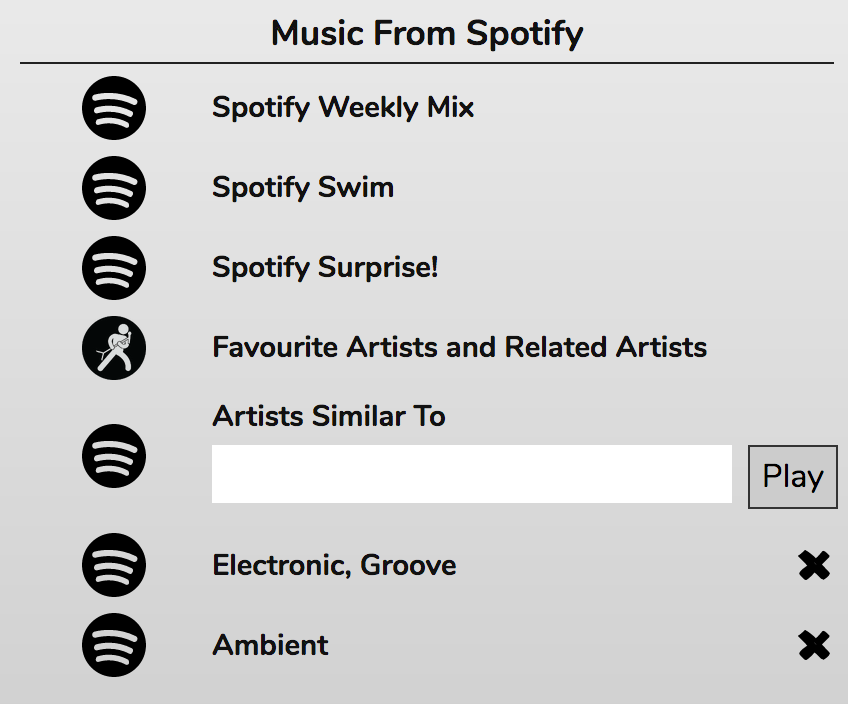
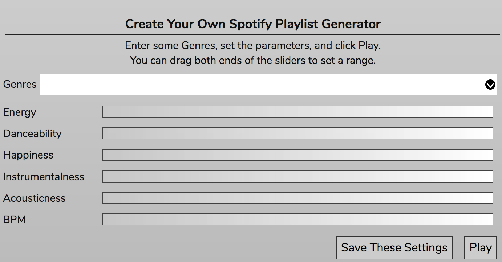

# Music Discovery

RompЯ contains many features to help you discover new music based on your listening habits. These will work best if you are using RompЯ with Mopidy and a Spotify Premium subscription and I'll be assuming that is the case. If you don't have Spotify then you can still get suggestions of albums you might like but you will not be able to add tracks to the playlist.

## The Discoverator

The Discoverator panel can be opened from the drop-down menu above the Info Panel (on the Desktop version, or in the top bar on the Phone skin).

The first four entries are 'Personalised Radio' stations that create dynamic playlists based on your listening habits. When you engage one of these stations the Current Playlist will populate with 5 tracks initially, adding a new one each time the first comes to the end. 'Consume' mode will be enabled to prevent your playlist from filling up. (You can always re-play tracks by using 'Recently Played Tracks')

The Last.FM stations are my attempt to recreate the old and much missed Last.FM radio stations. If you're [logged in to Last.FM](/RompR/LastFM) these stations use your Last.FM scrobbles along with Last.FM's suggestions engine to play you a mix of things you've played before along with new music that Last.FM suggests. The suggestions come from Last.FM, the music comes from Spotify.

The Spotify stations are similar except they use your listening history from RompЯ along with Spotify's suggestions.

Below the radio stations are several sections giving you suggestions of albums you might like. Again these are generated using your RompЯ listening history and Spotify's suggestions. You can add any of the albums to the Current Playlist. If you open one of the album panels (using the triangle icon) then you will get a full track listing for the album and a biography of the artist. Any of the tracks can be added to the Current Playlist.

## More Personalised Radio

The Personalised Radio panel includes more radio stations designed to help you discover music - these are only present for people using Mopidy with Spotify.

### Music From Spotify

The first three options (Spotify Weekly Mix, Spotify Swim, and Spotify Surprise!) use your listening habits to create dynamic playlists. Weekly Mix is based on your listening habits over the past week. The other two use successively wider criteria to select tracks.

Favourite Artists and Related Artists calculates your favourite artists based on number of listens and ratings and then plays you tracks by those artists and by other artists that Spotify says are 'related' - which should mean they're of a similar genre or style.

Finally you can type an artist name into 'Artists Similar To' to get tracks from artists that Spotify says are similar to that artist.

### Music From Everywhere

This panel allows you to make use of all your Mopidy sources - Spotify, Soundcloud, GMusic, etc to create playlists.

The Last.FM stations require you to be [logged in to Last.FM](/RompR/LastFM). They use your Last.FM scrobbles and Last.FM's suggestion engine to create playlists based on your listening over the past week, month, year, or all time. 'Lucky Dip' may produce a more varied selection than 'Mix'.

Favourite Artists will play a selection of tracks by artists determined to be your Favourites based on your listening habits.

Genre will play tracks of a specific Genre - note that some Mopidy backends do not support searching by Genre so results may be variable.

Tracks by Artist will play a random selection of tracks by the artist you enter.

### Create Your Own Spotify Playlist Generator

This is a Spotify feature that I found one day while browsing their documentation.

First enter up to five genres, which must be chosen from the drop-down list. Then you can drag both ends of the sliders to set a range of values for each of the parameters. Eg if you want 'High-Energy' tracks, drag the left-hand end of the 'Energy' slider to the right.

What these parameters actually mean, only Spotify really knows. They have algorithms that determine what these values are for each track but they won't say how they work.

The best thing with this panel is to experiment. If you find a group of settings that provide pleasing results you can Save them, they will then appear as a new option under 'Music From Spotify'.

## Listening to the Radio

When listening to internet radio, if the station you're listening to provides Artist and Title information, this will be displayed in the now-playing panel. If you hear a track you like you can give it rating or a tag. RompЯ will then search for it on Spotify and will add it into your collection if it finds it. It the track is already in your collection, the rating or tag will be added to that track instead.

If the track can't be found it will be added to your [Wishlist](/RompR/The-Wishlist)

## The Info Panel

Mopidy-Spotify users can get more suggestions about new music related to the currently playing track by using the Spotify [Info Panel](/RompR/The-Info-Panel)
