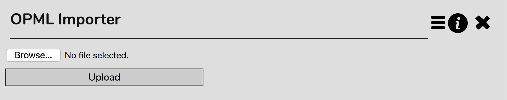
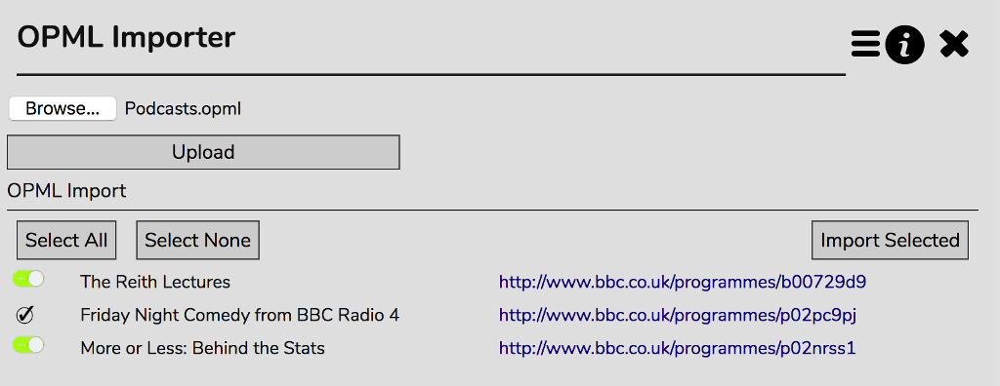

# OPML Importer

OPML is a file format used to share lists of Podcast subscritpions between programs.

If you have a bunch of Podcasts subscribed in another program and you'd like to import that same list inot RompR, first export your subscription list from the other rogram as an OPML file. You'll find plently of into on Google about how to do this for your specific program.

Once you have your OPML file, open the OPML Importer in RompR

Browse to your OPML file and then click Upload.

You will see the list of podcasts that are in the OPML file. Next to each name is a link to the webpage for that podcast.

Any podcast to which you are already subscribed in RompR will have a tick next to it. All others will have a checkbox. If there are any podcasts you don't want to import into RompR, un-select the checkbox. Click 'Import Selected' to import all the checked podcasts into RompR.

Imports via the OPML importer will honor the default settings set in the [Podcasts panel](/RompR/Podcasts)
