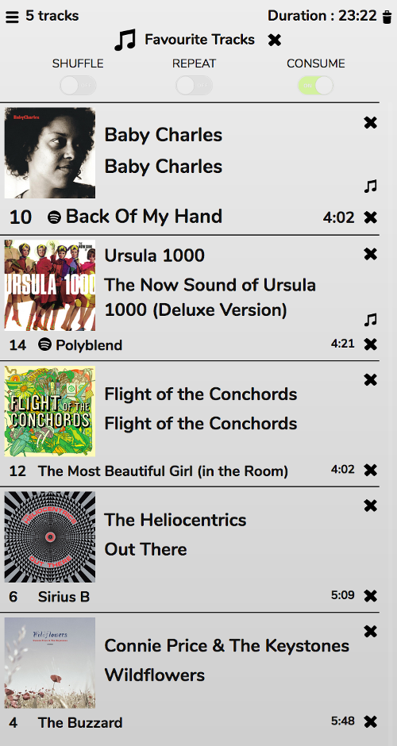
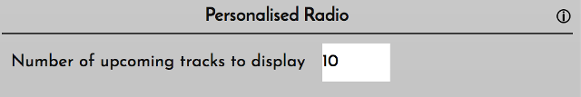

# Personalised Radio

Your listening habits, tags, and ratings, can be used to generate dynamic playlists on-the-fly.

Mopidy users get a host of extra online Music Discovery stations, that are described [here](/RompR/Music-Discovery).

These should all be self-explanatory. You can choose to play by Tag or Rating, or other criteria.

When you start one of these stations playing, 5 tracks will be added to the Play Queue, a header will appear at the top of the Playlist, and Consume mode will be enabled (and cannot be disabled while the station is playing).

You can skip, pause, stop, etc as normal. When a track has finished it will be removed from the Play Queue and a new one will be added. You can add tracks to the end of the Play Queue (or any other position) and re-order the Play Queue as normal. New tracks will only be added automatically when there are less than 5.

To stop the dynamic playlist generation and return to normal mode, either click the x next to the header or clear the playlist.

## Number of Upcoming Tracks

By default, 5 upcoming tracks will be displayed. You can change this number from the Prefs Panel

## Mobile Devices

When using a mobile device to run RompЯ, you should understand that the browser must be open for new tracks to keep being added. If the device sleeps (screen turns off) then the playlist will stop updating until you wake the device.

One way around this is to run [romonitor](/RompR/Rompr-And-Mobiles), which is capable of repopulating some of the Personalised Radio stations by itself.
