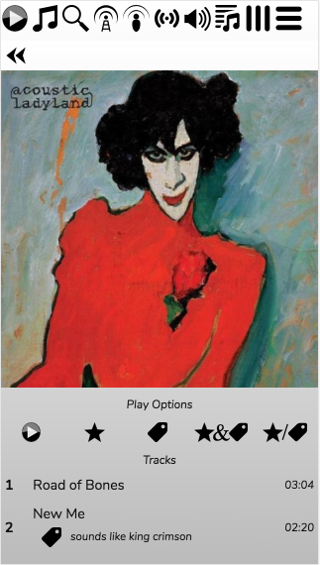

# The Phone Skin

The Phone Skin is the default if you're accessing RompЯ on a smaller screen. It lays things out in a different way but is functionally identical to the Desktop skin except that drag-and-drop is not supported, and nor is the Album Art manager. It also replaces the drop-down sections of the desktop skins with a more touch-oriented interface.
 
The phone skin adjusts its layout according to the size and orientation of your screen exactly like the [tablet skin](/RompR/Tablet-Skin) but it is really intended mainly for small screens.

For example here is how it looks on an iPhone SE showing the Now Playing screen.

Across the top are the icons to select different Music Sources, Volume, the Current Playlist and two dropdown menus - one of more icons that don't fit across the top, and one of plugins like the Ratings and Tags Manager, Playlist Manager, etc.

The default action on the Phone skin is to single-click to add items to the Current Playlist, though this can be changed from the Configuration menu.

Instead of using multiple drop-down panels, the phone skin cycles through various screens when you select items. For example, here is a screen of albums from the Music Collection for one artist.

The double arrow at the top is the 'back' button, which will take you back to the main Collection screen.

And here's an album being browsed

