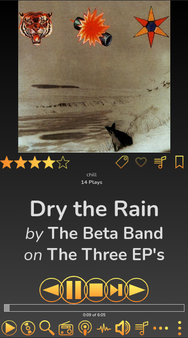
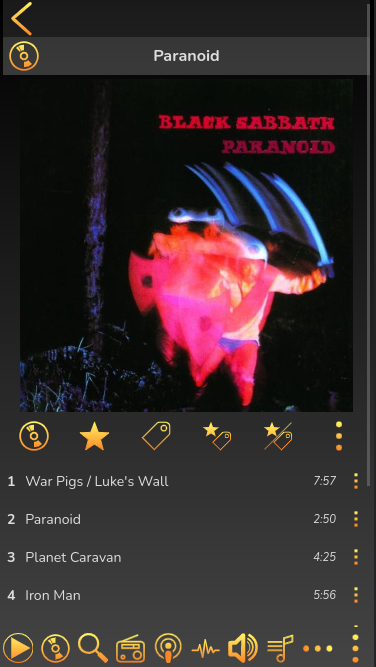
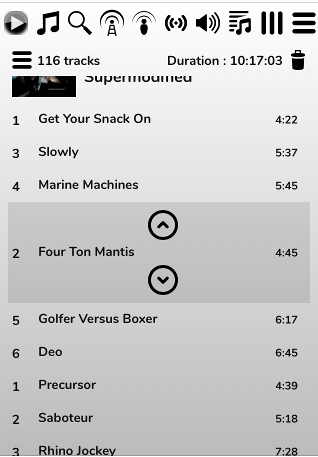

# The Phone Skin

The Phone Skin is the default if you're accessing RompЯ on a smaller screen. It lays things out in a different way but is functionally identical to the Desktop skin except that drag-and-drop is not supported, and nor is the Album Art manager. It also replaces the drop-down sections of the desktop skins with a more touch-oriented interface.
 
The phone skin adjusts its layout according to the size and orientation of your screen exactly like the [tablet skin](/RompR/Tablet-Skin) but it is really intended mainly for small screens.

For example here is how it looks on an iPhone SE showing the Now Playing screen.

Across the top are the icons to select different Music Sources, Volume, the Current Playlist and two dropdown menus - one of more icons that don't fit across the top, and one of plugins like the Ratings and Tags Manager, Playlist Manager, etc.

The default action on the Phone skin is to single-click to add items to the Current Playlist, though this can be changed from the Configuration menu.

Instead of using multiple drop-down panels, the phone skin cycles through various screens when you select items. For example, here is a screen of albums from the Music Collection for one artist.

The double arrow at the top is the 'back' button, which will take you back to the main Collection screen.

And here's an album being browsed

The Play Options do the following:

* Play the whole album. For albums from Spotify/GMusic etc this will always play the entire album, no matter if only a selection of tracks from it are in the display.
* Play only tracks that are in the display. This button will not be visible for sources where it is not relevant (eg local files).
* Play only tracks with Ratings
* Play Only tracks with Tags
* Play only tracks that are Rated and Tagged
* Play only tracks that are Rated Or Tagged

All these options apply to the Music Collection and Search Results. Reasons why the display may not show all the tracks from the album are firstly that Spotify search results often don't return the entire album, and secondly you could have an album that you added tracks to by rating or tagging them.

The phone skin also supports swiping. In the [Current Playlist](/RompR/The-Playlist) you can swipe left to remove tracks. This can be disabled by setting the option in the Config panel. This option also allows you to re-order tracks in the playlist - use a long press on the track and and up/down arrows will appear. Tap the arrows to move the track up and down the playlist.

Disabling the swipe option will make the phone skin behave like the [Tablet Skin](/RompR/Tablet-Skin)
