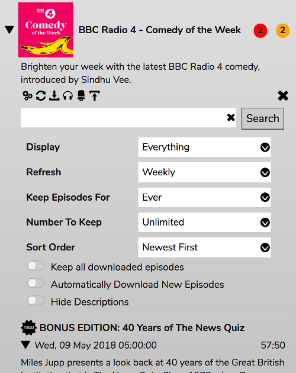
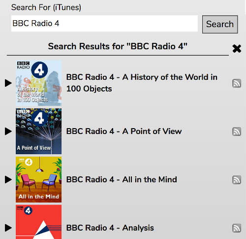

# Podcasts

The Podcasts panel allows you search for and subscribe to Podcasts.

Your subscribed podcasts will appear in the list.

## Subscribing To Podcasts

If you've found a podcast online and you'd like to subscribe with RompЯ, you'll need to copy the link to its RSS feed and paste it into the box at the top then click 'Retrieve'. Alternatively, you can use the Search box and subscribe from there.

## New and Unlistened Episodes

The numbers next to each podcast is the count of New (red background) and Unlistened (orange background) episodes in that podcast. New episodes are those which were newly added the last time the podcast was refreshed. Unlistsened episodes are those which are not New but have not been listened to.

## Viewing Podcasts

Each podcasts can be opened up to present you with the podcast's description, some options, and the list of episodes. Episodes can be added to the Playlist by douible-clicking.

## Podcast Controls

Below the description of the podcast are the controls for that podcast. From left to right these are:
* **Open the Podcast Configuration**
* **Refresh** the podcast
* **Download all episodes** - they will be downloaded to your web server and then available offline forever
* **Mark all episodes as listened**
* **Undelete deleted episodes** - any episode you have deleted that is still present in the podcast's feed will be brought back
* **Remove downloaded files**
* **Unsubscribe**

## Searching Within a Podcast

The search box below the controls will search that Podcast's episodes for the terms you enter

## Podcast Configuration

Each Podcast has several configuration options which are stored alongside the podcast.

* **Display:** You can choose to display Everything, only New Episodes, only New and Unlistened episodes, only New and Downloaded Episodes, or only Downloaded episodes.
* **Refresh:** Automatically refresh the podcast at the specified interval. This will be set automatically if the podcast feed provides that information.
* **Keep Episodes For:** Will not display any episodes that are older than this time period from now.
* **Number To Keep:** Allows you to limit the number of episodes displayed
* **Sort Order:** Either Newest first or Oldest first
* **Keep all downloaded episodes:** Downloaded episodes will not count towards 'Number To Keep' and will not be removed if they become older than 'Keep Episodes For'.
* **Automatically Download New Episodes:** After refreshing the podcast, any New episodes will automatically be downloaded
* **Hide Descriptions:** By default, don't show the dscription for each episode. You can still expand the descriptions by clicking the triangle.

## Episode Controls

Each episode has 3 controls under its description

These are (left to right)
* Download the episode
* Mark the episode as listened
* Delete the episode

## Searching For Podcasts

The Search box at the top searches iTunes for podcasts matching the terms you enter.

Search results are displayed very much like your subscribed podcasts, except there are no options or controls. You can still play an episode from a podcast in the search results just by double-clcking it.

To subscribe to a podcast from search results, click the RSS icon to the right.

## Using Mopidy-Podcasts

Users of the mopidy-podcasts backend will know that it has its own search engines, these are accessed using the main RompЯ search panel. If you're playing a podcast episode via that backend, an RSS icon will appear in the now playing area. Clicking that icon will add that podcast to your list of subscribed podcasts.

## Browsing Podcasts

You can also browse for Podcast episodes using the [TuneIn Radio Dicrectory](/RompR/Internet-Radio), though you will not be able to subscribe to podcasts you play this way.
