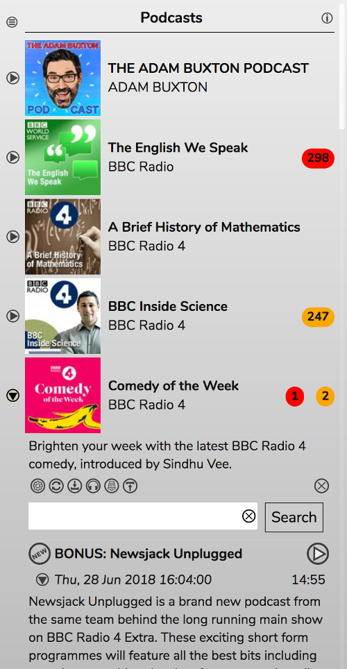
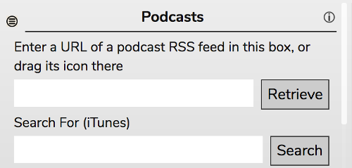
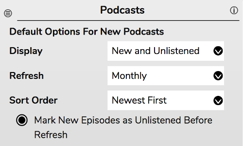
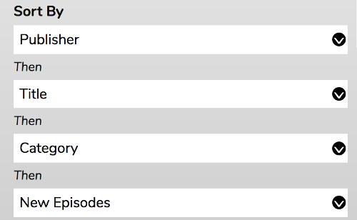
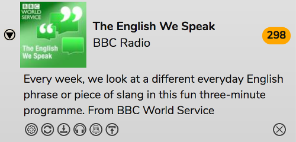
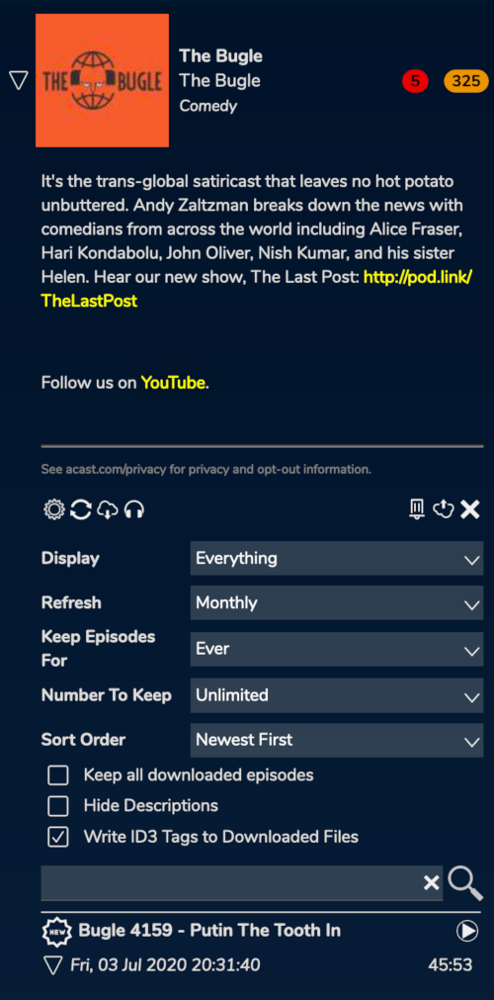
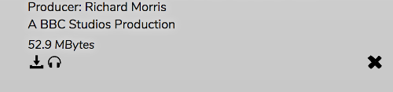
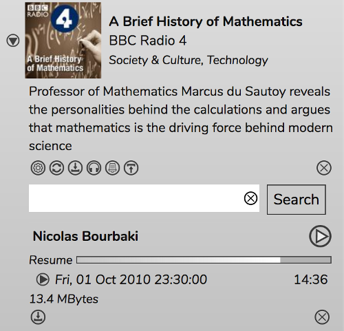

# Podcasts

The Podcasts panel allows you search for and subscribe to Podcasts.

Your subscribed podcasts will appear in the list.

## Subscribing To Podcasts

If you've found a podcast online and you'd like to subscribe with RompЯ, you'll need to copy the link to its RSS feed and paste it into the box at the top then click 'Retrieve'.

Alternatively, you can use the Search box and subscribe from there. These options are available by using the 'hamburger' menu at the top left.

You can also import a list of podcasts from another podcast program using the [OPML Importer](/RompR/OPML-Importer)

## New and Unlistened Episodes

The numbers next to each podcast is the count of New (red background) and Unlistened (orange background) episodes in that podcast.

**New** episodes are those which were newly added the last time the podcast feed was updated - in other words the last time the podcast publisher published a new episode.  The first time you add a podcast to Rompr, all episodes are 'New'. They will remain as 'New' until a new episode is published, at which point any you have not listened to will become **Unlistened**.

You can change the meaning of 'New' to mean 'episodes that were added the last time the podcast was refreshed'. To do this you enable the option in the Configuration Panel. When this option is enabled, New episodes (that have not been listened to) will become Unlistened when you refresh the podcast. If no new episodes have been published then there will be no New episodes in your list. Note that this was the default behaviour in Rompr prior to version 1.18

## Sorting The List

You can sort the list of Podcasts in a very flexible way. You have 4 options:

The first option will be the primary sort option. In this example, podcasts will be sorted by Publisher. For all podcasts where 'Publisher' is the same, those will be sorted next by Title, and so on. Some combinations will not be as useful as others - for example there can be no Podcasts where both Publisher and Title are the same, so the next two option have no effect, but other combinations might use all 4 levels.

The full set of options for each level is:

* Publisher
* Title
* Category
* Number of New Episodes
* Number of Unlistened Episodes (this will include New episodes because New episodes are Unlistened by definition)

## Viewing Podcasts

Each podcasts can be opened up to present you with the podcast's description, some options, and the list of episodes. Episodes can be added to the Playlist by douible-clicking.

## Podcast Controls

Below the description of the podcast are the controls for that podcast.

From left to right these are:
* **Open the Podcast Configuration**
* **Refresh** the podcast
* **Download all episodes** - they will be downloaded to your web server and then available offline forever
* **Mark all episodes as listened**
* **Undelete deleted episodes** - any episode you have deleted that is still present in the podcast's feed will be brought back
* **Remove downloaded files**
* **Unsubscribe**

## Searching Within a Podcast

The search box below the controls will search that Podcast's episodes for the terms you enter

## Podcast Configuration

Each Podcast has several configuration options which are stored alongside the podcast.

* **Display:** You can choose to display Everything, only New Episodes, only New and Unlistened episodes, only New and Downloaded Episodes, or only Downloaded episodes.
* **Refresh:** Automatically refresh the podcast at the specified interval. This will be set automatically if the podcast feed provides that information.
* **Keep Episodes For:** Will not display any episodes that are older than this time period from now.
* **Number To Keep:** Allows you to limit the number of episodes displayed
* **Sort Order:** Either Newest first or Oldest first
* **Keep all downloaded episodes:** Downloaded episodes will not count towards 'Number To Keep' and will not be removed if they become older than 'Keep Episodes For'.
* **Hide Descriptions:** By default, don't show the description for each episode. You can still expand the descriptions by clicking the triangle.
* **Write ID3 Tags to Downloaded Files:** A lot of us like to download podcasts to listen to offline. I particularly like to copy them to a USB stick to play on my car stereo when I'm driving, as I frequently do, through areas of remote countryside with no radio or phone reception. A few podcasts (I'm looking at you, Welcome To Night Vale, though you're not the only one but it's ironic how I can't listen to you when I'm in remote areas) do not ID3 tag their files, which confuses the living doodoo out of my car stereo and makes everything play in the wrong order. Selecting this option will tag downloaded files with artist, albumartist, album, and title tags, as well as filling in the track number if it doesn't exist with something which will keep the tracks in order.

You can set default values for some of these options, to be set on newly subscribed podcasts, from the Configuration Panel. Note that some podcasts announce their own refresh period. In this case that value will override your default.

## Episode Controls

Each episode has 3 controls under its description

These are (left to right)
* Download the episode
* Mark the episode as listened
* Delete the episode

## Searching For Podcasts

You search for Podcasts using RompR's main search panel.

Search results are displayed very much like your subscribed podcasts, except there are no options or controls.
You can still play an episode from a podcast in the search results just by double-clcking it.

To subscribe to a podcast from search results, click the RSS icon to the right.

## Resuming Playback

If you stop or skip a Podcast episode while it is playing, Rompr will store the playback position, allowing you to resume from where you left off.

Double-click the Resume bar to add the podcast to the Play Queue and start playback from the position shown. Note that this functionality may be flaky if you use Mopidy, there appears to be a bug in Mopidy to do with seeking.

If the episode is already in the playlist, the episode will not be added again, instead the exisiting item in the playlist will be played from the resume position.

## Browsing Podcasts

You can also browse for Podcast episodes using the [TuneIn Radio Directory](/RompR/Internet-Radio), though you will not be able to subscribe to podcasts you play this way.

## Refreshing Podcasts

RompR's backend Daemon takes care of refreshing Podcasts. The time it refreshes at is based on your refresh frequency setting (eg weekly) and the time and date
of the last published epsisode - so if your favourite podcast always publishes at 12pm on Tuesday, and you set the refresh option to Weekly, RompR will refresh that
podcast at 12pm every Tuesday. RompR also understands that humans are fallible creatures and so it does permit some leeway in the times - if it doesn't find a new episode
it will try again an hour or two later, and also the next day.

