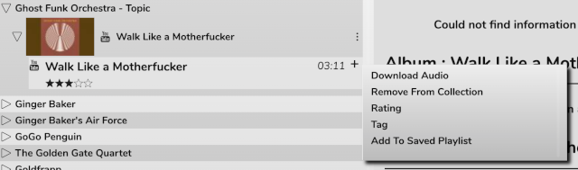

# Using RompЯ with Mopidy

[Mopidy](http://www.mopidy.com/) is an mpd-like player that does everything mpd does and more. It plays Spotify, for one thing :)

If you use Mopidy, please make sure you read the following to ensure you get the best out of it.

## Communication with Mopidy

RompЯ communicates with mopidy using its MPD frontend - you must have mopidy-mpd installed.
Mopidy version 1.1 or later is required.

In mopidy.conf, your mpd section needs to contain

    [mpd]
    connection_timeout = 120

120 is a minimum (it's in seconds). If you have a large music collection try a much larger number, say 600.

### Using the HTTP Frontend for Improved Responsiveness

If your Mopidy has its HTTP frontend enabled, RompR can use that *in addition to* the MPD interface. This is optional, it makes RompR a little more
responsive when things change within Mopidy. RompR can also use this connection to query Mopidy for album art - which is very handy if the Mopidy backend supports
it - and when searching for tracks, which is more efficient than using the MPD interface.

You will, however, have to configure a couple of things.

You need to configure Mopidy to allow HTTP connections from your RompR installation. The correct way to do this is to set the http/allowed_origins parameter in mopidy.conf.
However, so long as your Mopidy installation is not connected to the internet you might find it easier to set http/csrf_protection=false in mopidy.conf.
See the Mopidy docs for more information.

	[http]
	allowed_origins=
		address.you.type.into.your.browser

or

	[http]
	csrf_protection=false

If RompR is able to connect to Mopidy in this way, you will see a connection message that displays two port numbers when you first open RompR.

### Fixing Mopidy's Consume Bug

If you use Mopidy with consume enabled you've probably encountered a bug where it gets stuck playing the same track over and over again.
I submitted a fix for this in early 2020 but nobody seemed interested. Out of frustration I added this workaround to Rompr so that
Rompr will do the consuming. It uses the [Backend Daemon](/RompR/Backend-Daemon) to do this. The Consume control in Rompr will control Rompr's
consume workaround option instead of Mopidy's consume setting.

It's best if you also have the HTTP interface enabled as above, so that the tracklist updates responsively when the consume happens.

Note that RompR will continue to do the consuming even if you use another client to control Mopidy, but that client will display and control
Mopidy's internal consume setting, which could have unwanted consequences.

## Building Your Music Collection

The configuration panel will allow you to choose various sources from which to build your [Music Collection](/RompR/Music-Collection).

You will only see options for backends that are enabled in Mopidy. The complete list of supported backends is:

* **Local Music** ('local' backend must be enabled)
* **Beets** ('beets' backend must be enabled)
* **Beets Local** ('beetslocal' backend must be enabled)
* **Spotify Playlists** ('spotify' backend must be enabled) *This will add all tracks from your Spotify Playlists into your collection. Your playlists will still be available as Playlists even if you don't select this option*
* **Spotify 'Your Tracks'** ('spotify' backend must be enabled)
* **Spotify 'Your Albums'** ('spotify' backend must be enabled)
* **SoundCloud 'Liked'** ('soundcloud' backend must be enabled)
* **SoundCloud 'Sets'** ('soundcloud' backend must be enabled)
* **VKontakte** ('vkontakte' backend must be enabled)
* **Youtube Music Liked Songs** ('ytmusic' backend must be enabled)
* **YouTube Music Albums** ('ytmusic' backend must be enabled)
* **YouTube Music Subscription** ('ytmusic' backend must be enabled)
* **Qobuz Favourite Albums** ('qobuz' backend must be enabled)

If you don't want to build a collection this way, tracks from anywhere can be added to the collection by tagging or rating them at any time.

Tagging or rating a track that is playing on a radio station will make RompЯ search for it using all available online backends and add it to your collection if it can find it, or to your [wishlist](/RompR/The-Wishlist) if it can't.

## If you use Mopidy-Beets

You can create your Music Collection from your Beets Library by selecting the option in the Configuration Panel. There is also a box to enter the address of your Beets server. This is not required for building the Music Collection, but if you set this value then you will be able to retrieve additional file information and lyrics from your Beets server.

You need to make sure that your browser can access your Beets server for this to work. If your browser runs on a different computer than your beets server, then your beets config.yaml needs to contain

    web:
      host: IP.address.of.beets.server

Otherwise beets will not allow RompЯ to talk to it. Your configuration for beets in mopidy must also contain this IP address as Beets will only communicate via the supplied IP address.

## Qobuz Support woth Mopidy

The [Mopidy-Qobuz-Hires](https://github.com/vitiko98/mopidy-qobuz) backend works reasonably well provided you set the search_album_count and search_track_count
values to something rather bigger than the default. The main limitation with this backend is that it doesn't support album browsing, so sometimes with search
results you will only see one track off an alum, or just 'Album:Album name'. To fix this the backend will need updating to support browsing
of qobuz:album URIs, but it appears to be unmaintained at the time of writing.

## Mopidy-YTMusic and Mopidy-Youtube

To work properly with RompR you need Mopidy-YTMusic 0.3.8 or later. This is the preferable solution as Mopidy-YTMusic supports
artists and albums in a way that is the same as all the other Mopidy backends, whereas Mopidy-Youtube does not. You can use
Mopidy-Youtube in parralel with Mopidy-YTMusic, to give you access to Youtube Videos and Youtube Music.
RompR's Mopidy-Youtube support is based on using it for standard YouTube, not Youtube Music. You should use Mopidy-YTMusic
for Youtube Music support.

I've put a lot of effort into using these backends to replace a lot of what RompR used to rely on Mopidy-Spotify for but bear in mind
Youtube Music does not have a proper API and there is some information - like track numbers - that is extremely unreliable.
RompR likes track numbers because they make Playcounts more accurate, and RompR will try very hard indeed to get
Youtube to give it a track number when it needs one.

## Search

If Mopidy's HTTP interface is available and you do a search in RompR and limit the search to specific backends the search will be performed
using Mopidy's HTTP interface instead of the MPD interface. This can provide significantly improved search performance and better
quality information and really helps when running 'Music From Anywhere' personalised radio, but it can use a lot of RAM and in certain setups
it might be a lot slower. You can disable this behaviour by unchecking 'Use Mopidy HTTP interface for Search' on the rompr/?setup screen.

## Scanning Local Files

Where MPD provides an 'update' command that RompЯ can use to update MPD's music database, Mopidy does not and so RompЯ can not easily make
Mopidy scan local files - this has to be done with the 'mopidy local scan' command, which cannot be run directly by RompЯ .

One solution is to run mopidy local scan yourself first, but this isn't so convenient and there is an alternative.

I've tested this on Ubuntu and Raspberry Pi OS. I cannot test it on other distributions. It will not work on macOS.

* Firstly, mopidy must be running on the same machine as your webserver. This will not work otherwise.
* Secondly you need to set up Mopidy so it is running as a service. See the Mopidy documentation for how to do that.
* Thirdly, you need to give your webserver permission to run the 'mopidyctl local scan' command as sudo *without needing a password*. To do this, you do the following:

	sudo visudo -f /etc/sudoers.d/mopidyscan

This will open an empty file. Take great care to get the following right, as it might be difficult to undo if you get it wrong.
In this example I am assuming that your webserver runs as the user www-data, the hostname of your machine is raspberry,
and the path to mopidyctl is /usr/sbin/mopidyctl. Make sure you know the correct values for these parameters before starting.
In the suoders file you need to add a line

    www-data raspberry = (root) NOPASSWD: /usr/sbin/mopidyctl

Save the new file (in the default vi editor you need to press I to get into Insert mode, then add the line, then do the very obvious and not at all
ridiculous Esc:wq (Escape-colon-w-q) to save.
Then go to /rompr/?setup and enable the option for "Allow RompR to run mopidy local scan when creating the Music Collection"

If you haven't done this right, then your music collection update will just hang. You'll probably have to reboot to clear it.

## Genres

Note that only Mopidy-Local seems to return Genres, so Genre-based Collection functions will not work as your might expect if you use Spotify, Soundcloud, etc.

## Downloading Youtube Tracks

If you add Youtube tracks to your Music Collection, you'll be given an option to download the audio.

In order for this to work you must have the programs youtube-dl or yt-dlp, and either avconv or ffmpeg installed on your system.
On macOS you can get youtube-dl and ffmpeg using HomeBrew, on Linux there are probably packages for both of these, or yt-dlp can be installed using pip.
Note that yt-dlp is preferred over youtube-dl, and yt-dlp requires ffmpeg, avconv will not work. So if you have yt-dlp installed you must also have ffmpeg.

The binaries must be installed so that they can be executed by your webserver. RompR will look under the following paths, in this order:
/usr/local/bin/, /opt/local/bin/, /opt/homebrew/bin/, /usr/bin/

If you're trying to use this feature and you keep getting an error, enable debug logging and look at the output.
If all the binaries are installed then the debug log will tell you the command line it is using, you should try that from a console to look for error messages.

Assuming it works, the YouTube video will be downloaded and the audio will be extracted to a FLAC file which will be streamed from your webserver
using Mopidy's Stream backend the next time you add the track to the play queue.

The file will be downloaded to a subdirectory under rompr/prefs/youtubedl/. Assuming the download actually started there will be a log file
in that directory which includes the complete command line that was used and all of the downloader's text output. (Note, these files will
be cleaned up at regular intervals).

If you have the flac packages installed (sudo apt install flac) then the downloaded file will be tagged with the artist and track name.
Tagged tracks can be moved into your 'normal' music collection. Provided you have the option to 'Prefer Local Music to Internet Sources' enabled,
a Collection Update will discover the file. Moving the files to your music collection means they can be played using the 'local' backend
which supports seeking and pausing much better than the stream backend.

One way is to move the downloaded files from rompr/prefs/youtubedl into an appropriate folder, do 'mopidy local scan' and rescan your collection.

Another approach is to symlink rompr/prefs/youtubedl into a youtubedl subdirectory off your Music Directory and make sure the webserver has write permissions.
When you download a track you simply need to 'mopidy local scan' and then Update your Music Collection.
**Note though, that RompR is "in control" of the prefs/youtubedl directory and WILL DELETE anything that it doesn't recognise. Also the directory
you symlink to MUST be called youtubedl or everything in it will get deleted.**

### Youtube Music Premium Subscribers

Youtube Music Premium subscribers have the ability to stream audio at a higher quality. To ensure your downloads use the highest quality streams
you need to install yt-dlp and edit your /etc/yt-dlp.conf and set the --cookies option so it points to your cookie file.
The cookie file must also be writeable by your webserver.
This is the same cookie file you reference in the musicapi_cookiefile option for mopidy-youtube. See Mopidy-Youtube's documentation for more info.
