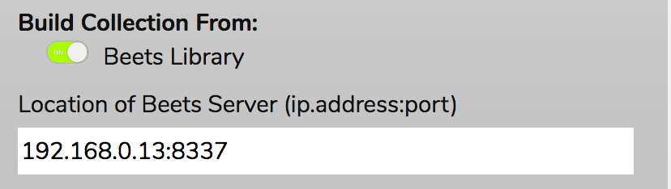
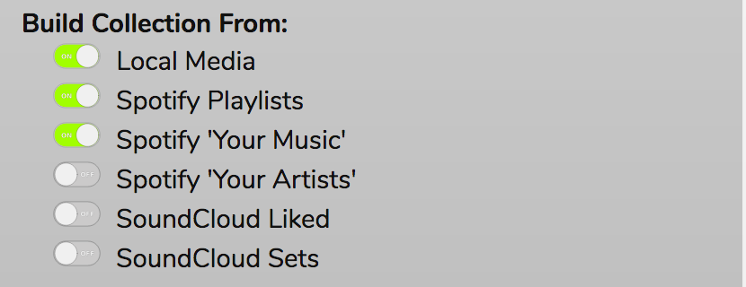

# Using RompЯ with Mopidy

[Mopidy](http://www.mopidy.com/) is an mpd-like player that does everything mpd does and more. It plays Spotify, for one thing :)

If you use Mopidy, please make sure you read the following to ensure you get the best out of it.

## Communication with Mopidy

RompЯ communicates with mopidy using its MPD frontend.
Mopidy version 1.1 or later is required.

## If you use Mopidy-Beets

You can create your Music Collection from your Beets Library by selecting the option in the Configuration Panel. There is also a box to enter the address of your Beets server. This is not required for building the Music Collection, but if you set this value then you will be able to retrieve additional file information and lyrics from your Beets server.

You need to make sure that your browser can access your Beets server for this to work. If your browser runs on a different computer than your beets server, then your beets config.yaml needs to contain

    web:
      host: IP.address.of.beets.server

Otherwise beets will not allow RompЯ to talk to it.

## If you use mopidy-local-sqlite

There seems to be a bug in the scanner engine in mopidy's sqlite backend where sometimes it puts tracks on the wrong albums. Putting the following in your mopidy configuration seems to work around this.

    [local-sqlite]
    enabled = true
    use_album_mbid_uri = false
    use_artist_sortname = false

## Building Your Music Collection

The configuration panel will allow you to choose various sources from which to build your [Music Collection](/RompR/Music-Collection).

You will only see options for backends that are enabled in Mopidy. The complete list of supported backends is:

* **Local Music** ('local' backend must be enabled)
* **Beets** [('beets' backend must be enabled)](/RompR/Rompr-And-Mopidy)
* **Beets Local** ('beetslocal' backend must be enabled)
* **Spotify Playlists** ('spotify' backend must be enabled)
* **Spotify 'Your Music'** ('spotify-web' backend must be enabled)
* **Spotify 'Your Artists'** ('spotify-web' backend must be enabled)
* **Google Play** ('gmusic' backend must be enabled)
* **SoundCloud 'Liked'** ('soundcloud' backend must be enabled)
* **VKontakte** ('vkontakte' backend must be enabled)

If you don't want to build a collection this way, tracks from anywhere can be added to the collection by tagging or rating them at any time.

Tagging or rating a track that is playing on a radio station will make RompЯ search for it on Spotify (if you have Spotify) and add it to your collection if it can find it, or to your wishlist if it can't.

Note that if you use local files, RompЯ cannot get mopidy to scan them because mopidy does not support that. You will therefore have to run "mopidy local scan" yourself, then restart mopidy before you update the collection from rompr. (If you use the sqlite backend in mopidy you do not need to restart it)
