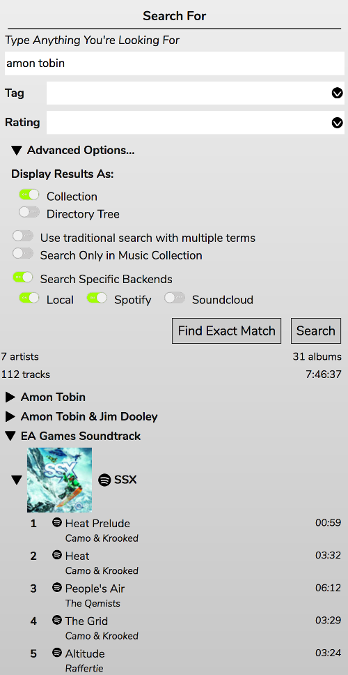
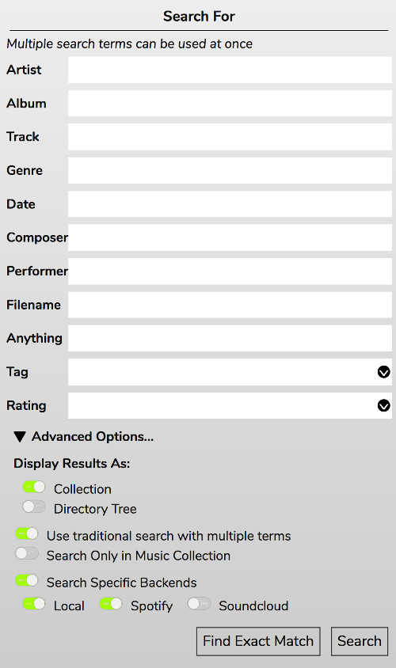

# Searching For Music

The search panel allows you to ... search for music. For mpd users, this searches your collection. For Mopidy users there are more options and I'll be concentrating on Mopidy here.

By default the search terms will search for anything that matches - track title, album title, artist name, even genre on backends that support it. All backends will be searched by default but you can limit the search to specific backends by selecting the options. You can also limit the search to just your Collection if you want.

The Tag and Rating boxes work as follows:

If no search term is entered then tracks from your collection that match either the tag(s), the rating, or both will be returned. If a search term is entered then that must also match.

You can Display Results as a Collection, which will look just like your Music Collection, or as a Directory Tree, which will look like the File Browser.

## More Specific Search Terms

By selecting 'Use traditional search with multiple terms' you can search for more specific fields:

You can use multiple terms to narrow things down even more. Note that some mopidy backends do not support some terms, and buggy ones may crash if asked to search for something they don't support.
