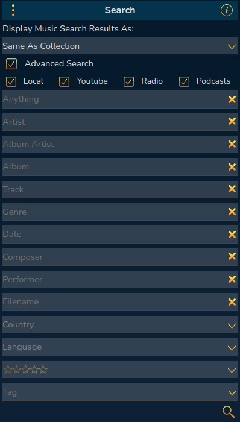

# Searching For Music, Podcasts, and Radio Stations

The search panel allows you to search all of RompR's available sources. The default view contains a checkbox for each type of thing you can search for. In this example
I'm using Mopidy with the Local and Youtube backends. RompR contains built-in support for searching for Podcasts and Radio Stations. You do not need to use
any Mopidy Radio or Podcast backends - and functionality will be limited compared to RompR's if you do.

By default the single 'Anything' search term will match on anything - track title, album title, artist name, even genre on backends that support it.
You can limit the scope of the search by using the checkboxes, so if you only want to search for Podcasts you can do that.

RompR includes two sources for Podcasts - one is an Apple Podcasts (iTunes) search. The other is TuneIn, but TuneIn only returns podcast episodes - not feeds -
so you cannot subscribe to podcasts returned by TuneIn.

RompR includes 3 sources for Internet Radio -  the Community Radio Browser, TuneIn, and IceCast Radio.

If you open the Advanced Menu using the 3 dots at the top left you'll get some more options

Enabling 'Advanced Search' displays all the available search terms. Note that most of these terms are only supported when searching for Local Music and will not do
anything if you use them to search for, say, Podcasts or Radio Stations.

The 'Country' and 'Language' search items apply only to the the Community Radio Browser, and can used to limit the results you get from that search engine.
They will have no effect on any of the other search engines.

The Tag and Rating boxes work as follows:

If no search term is entered then tracks from your collection that match either the tag(s), the rating, or both will be returned.
If a search term is entered then that must also match.

