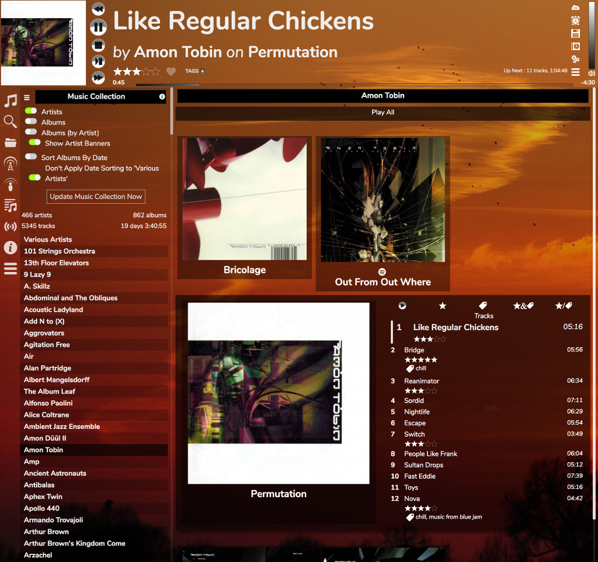
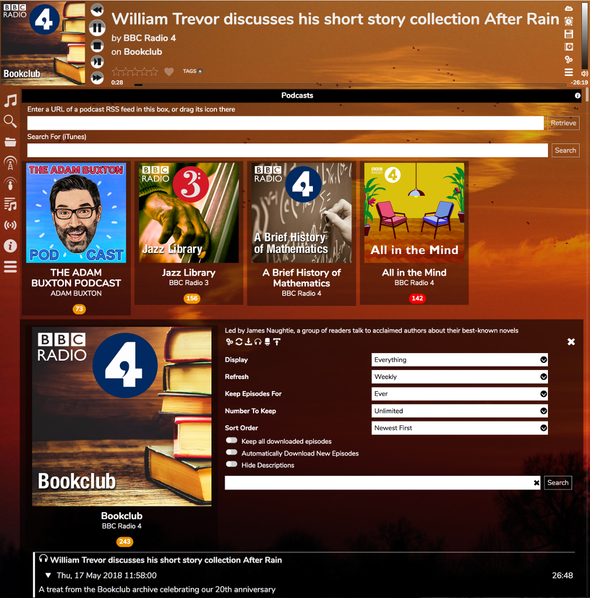

# The Skypotato Skin

I still suck at making up names. Originally this one was supposed to be a bit more iTunes-like, but it evolved and ended up not being like that, which is a good thing. A few of you may still get the Skypotato reference, I'll leave it at that.

It is based on the [Fruit Skin](/RompR/Fruit-Skin) but puts more emphasis on displaying album art. It is aimed at desktop browsers but it may also work well on larger-screened touch devices.

When browsing albums, the Play Options you will be presented with work the same way as in the [Phone Skin](/RompR/Phone-Skin)
