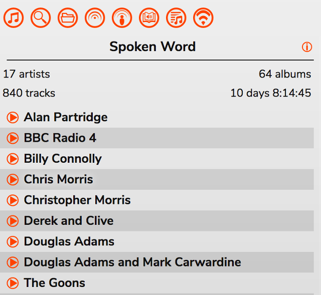
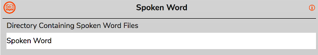

# Spoken Word Collection

The Spoken Word panel is intened for keeping track of local files you don't to be considered part of the Music Collection. This might include things like Audiobooks, Comedy Shows, whatever you consider to be 'not music'.

The Spoken Word panel obeys the same sort options as the [Music Collection](/RompR/Music-Collection).

RompR does not include any way of purchasing or downloading Audiobooks, you must use the appropriate software for that.

To make files appear in the Spoken Word Collection they must be stored under a specific directory within your Music Collection. For example, if your Music Collection is at

    /home/you/Music

and that is the path configured in your mpd.conf or mopidy.conf

then you could have your Spoken Word files stored in

    /home/you/Music/Spoken Word

You would then configure this from the Settings panel:

You can have whatever directory structure you like underneath 'Spoken Word', so just move all your Audiobooks and whatever else into that directory.

Once you've done this you will need to Update your Music Collection. Mopidy users will have to do a 'mopidy local scan' first.

There are two advantages of storing Spoken Word items this way:

* Spoken Word files will not be included in any Personalised Radio, irrespective of what tags or ratings they have
* You will get a 'Resume Bar' if you Stop a Spoken Word track part way through, just like with Podcasts - this means you can come back later and carry on where you left off.
