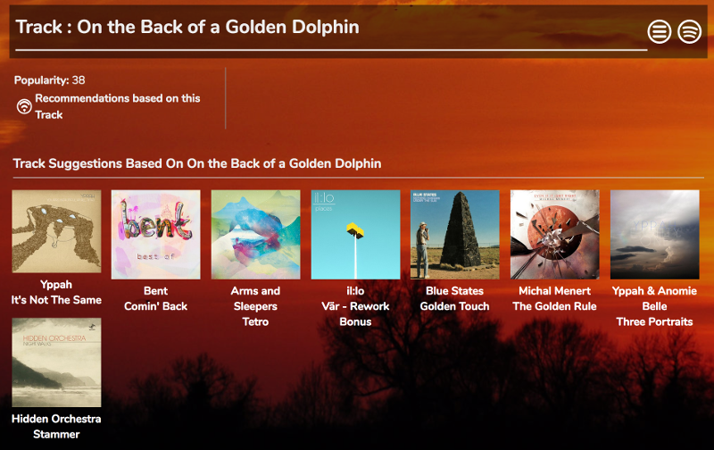
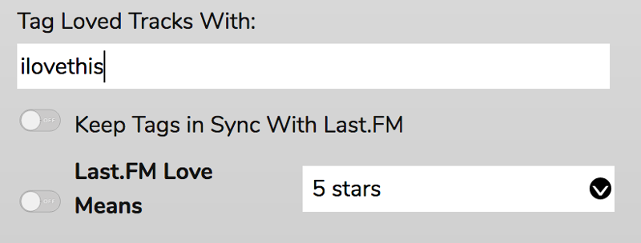
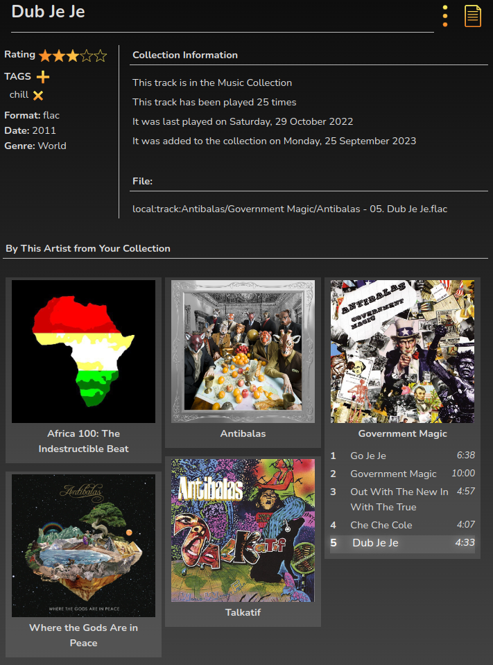
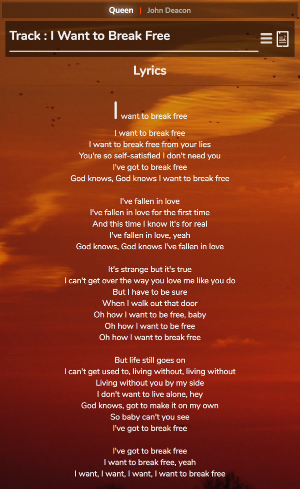

# The Info Panel

The Info Panel will display information about the currently playing Artist, Album, and Track drawn from a choice of online sources - currently Last.FM, Wikipedia, MusicBrainz, Discogs, and Spotify. You can also get Lyrics (works best with local files tagged with Lyrics), Soundcloud information (if you're playing a track from Mopidy-Soundcloud) and Youtube videos.

## Spotify

The Spotify Info panel is another source of Music Discovery.

You'll get a display of a biography of the artist, options to start up dynamic playlists based on this artist,
and a list of albums by the artist. Each album can be opened to display a track listing.

Mopidy-Spotify users can add tracks and albums to the Play Queue directly from this panel. If you don't have Spotify but you do have Youtube Music support
(either via mopidy-youtube or mopidy-ytmusic) then you can double-click the track names and RompR will search for them and play them if it finds them.

The Musical Notes icon will add the album directly into your Music Collection. This is not available if you don't have Spotify support.

The 'Similar Artists' option allows you to delve deeper into Spotify. You'll get a list of artists that are 'similar' to the current one. Each one can be opened up to get a biography and a list of that artist's albums. Again, tracks can be added to the Playlist directly from here.

The Track information section will give you suggested new tracks to listen to. if you have Mopidy-Spotify you can add them to the Play Queue directly from here

## Last.FM

The Last.FM panel gives you any biographical information that can be found for the current Artist, Album, and Track on Last.FM.

If you are [logged in to Last.FM](/RompR/LastFM) ADD TAGS adds tags to the track on Last.FM.

If you want to keep your Last.FM tagging in sync with your RompЯ Collection, there is an option to 'Keep Tags In Sync With Last.FM' in the Configuration panel. When this is enabled, using either RompЯ's tags or the Last.FM panel will add (or remove) those tags to the track both on Last.FM and in RompЯ's Collection.

You can also use the option 'Last.FM Love Means' to automatically add a rating to tracks in the collection when you click the 'Love' button in RompЯ, and to automatically Love the track on Last.FM if you give it that Rating in RompЯ.

## Collection Information

This panel displays information about the file being played. The information includes format information from the player,
and information from the Music Collection.

You can add tags and ratings to tracks from here, or add the track to the collection if it is from an online source.

This panel will also display every album from your Collection that contains a track by the current Artist, you can add tracks directly
to the play queue from here.

## Lyrics

Lyrics for songs will be displayed if they can be found. Either they can be extracted if they are embedded in your local files and you have set the Path To Local Music correctly as explained for [Album Art](/RompR/Album-Art-Manager#using-local-images), or if you use [Mopidy-Beets](/RompR/Rompr-And-Mopidy) along with the Lyrics plugin for Beets, they can be retrieved from your Beets server.

In some cases, RompЯ may be able to find Lyrics on the internet.

## Other Info Sources

The other panels should be self-explanatory. There are also Back, Forward, and a History menu on the Info panel so you can keep playing new tracks while reading about old ones.

The buttons above the info panel are (left to right)

* Dropdown menu for choosing various plugins which display in the info panel
* History
* Back
* Forward
* Collection Information
* Last.FM
* Wikipedia
* Musicbrainz
* Discogs
* Lyrics
* Soundcloud (for when Soundcloud tracks are playing)
* Spotify
* Videos