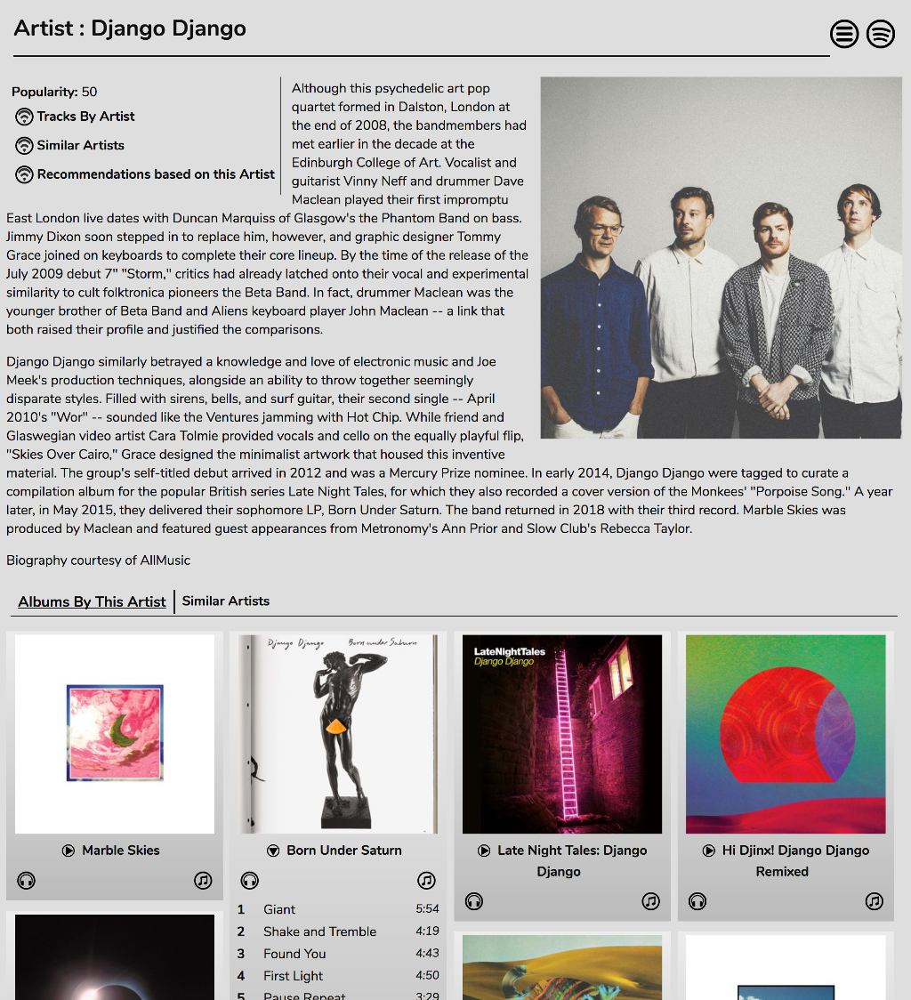
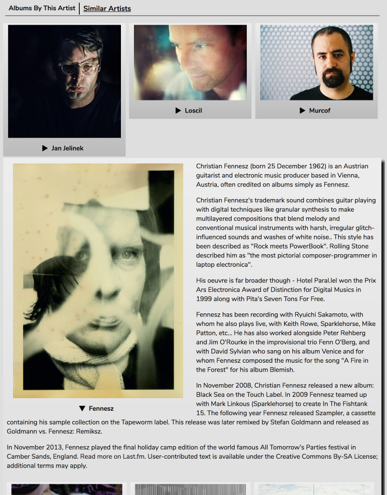
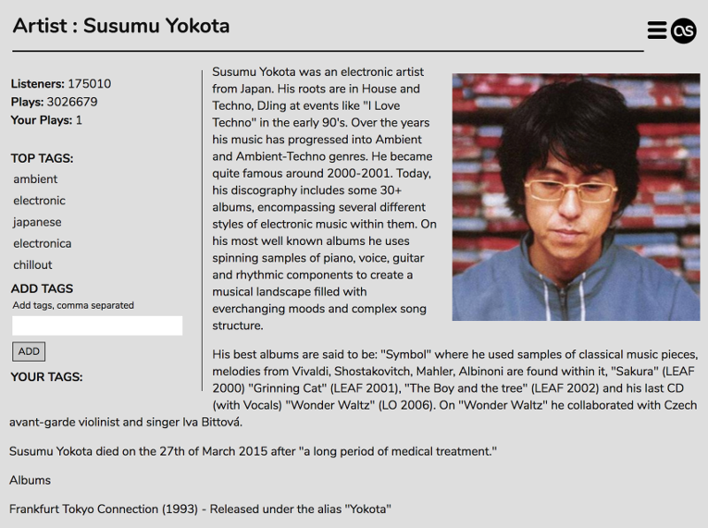
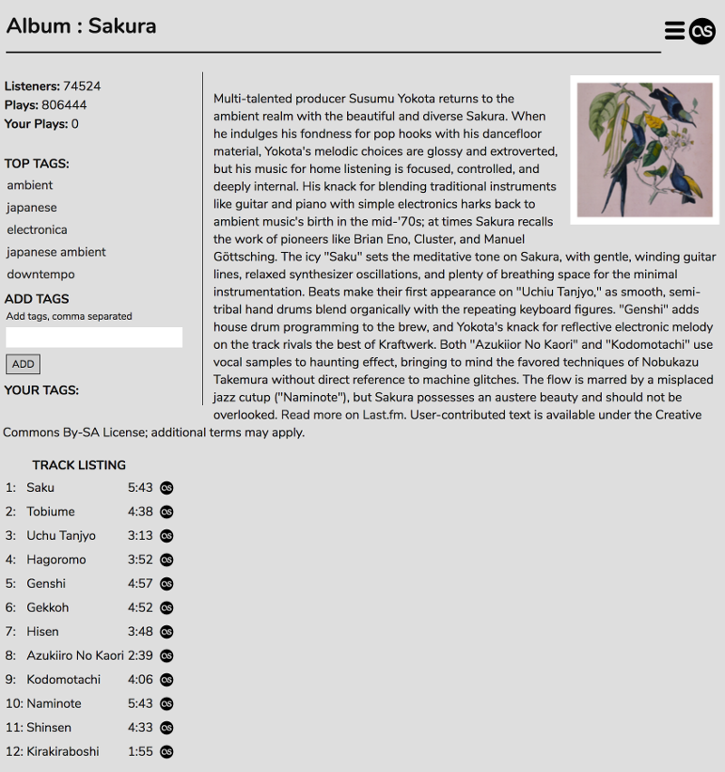
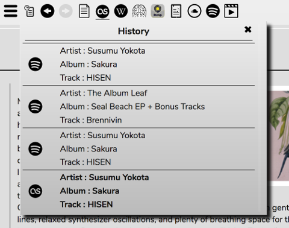

# The Info Panel
The Info Panel will display information about the currently playing Artist, Album, and Track drawn from a choice of online sources - currently Last.FM, Wikipedia, MusicBrainz, Discogs, and Spotify. You can also get Lyrics (works best with local files tagged with Lyrics), Soundcloud information (if you're playing a track from Mopidy-Soundcloud) and Youtube videos.

## Spotify

The Spotify Info panel is another source of Music Discovery.

You'll get a display of a biography of the artist, options to enabled dynamic playlists based on this artist, and a list of albums by the artist. Each album can be opened to display a track listing. Mopidy-Spotify users can add tracks to the Playlist directly from this panel.

The 'Similar Artists' option allows you to delve deeper into Spotify. You'll get a list of artists that are 'similar' to the current one. Each one can be opened up to get a biography and a list of that artists's albums. Again, tracks can be added to the Playlist directly from here.

## Last.FM

The Last.FM panel gives you any biographical information that can be found for the current Artist, Album, and Track on Last.FM.

The stats and tags in these panels refer to your Last.FM profile. ADD TAGS adds tags to the track on Last.FM. If you want to keep your Last.FM tagging in sync with your RompЯ Collection, there is an option to 'Keep Tags In Sync With Last.FM' in the configuration panel. When this is enabled, using either RompЯ's tags or the Last.FM panel will add (or remove) those tags to the track both on Last.FM and in RompЯ's Collection. You can also use the option 'Last.FM Love Means' to automatically add a rating to tracks in the collection when you click the 'Love' button in RompЯ, and to automatically Love the track on Last.FM if you give it that Rating in RompЯ.

## Other Info Sources

The other panels should be self-explanatory. There are also Back, Forward, and a History menu on the Info panel so you can keep playing new tracks while reading about old ones.

