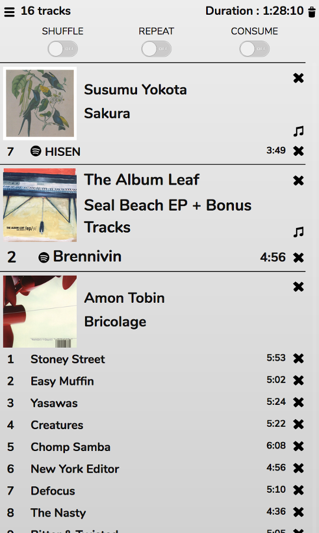

# The Playlist
The Playlist might be better termed the 'Play Queue', but mpd uses the term Playlist, or 'Current Playlist'. This panel appears on the right-hand-side of the window in the default Desktop skin. It shows tracks that are currently playing and tracks queed to play next, in the order in which they will play.

To add a track or album (or all tracks by an artist) to the end of the Playlist, double-click it in the collection (single-click on the Phone skin). On the Desktop skins you can also drag tracks to any position in the playlist. You can re-order tracks or albums by dragging them within the playlist, and remove them by clickng the x.

Mopidy users can add tracks to the Playlist from many other sources too - the [Discoverator](/RompR/Music-Discovery) panel and the [Spotify Info](/RompR/The-Info-Panel) panel.

The 'Musical Notes' icon will appear next to Spotify albums. Clicking this will add the entire album to your collection.

## Shuffle, Repeat, Consume
'Shuffle' will play the tracks from the Playlist in a random order (it does not re-order the Playlist).

'Repeat' will play the entire playlist on a loop, honoring Shuffle mode if it is enabled.

'Consume' will remove tracks from the Playlist as they are played. This is enabled by default when using dynamic playlists, to prevent your playlist becoming huge.

MPD users also have an option to enable Crossfade (this is not supported in Mopidy) and use Replay Gain - but Replay Gain will only work if your tracks are tagged with Reply Gain information.

## Non-Queueing Mode
Although the default option (and the way mpd works) is to add tracks to the Playlist when you click them, you can also enable a more 'Media Centre-like' mode. In the Configuration panel is an option for 'CD Player Mode'. When this is enabled, when you double-click a track it will play immediately, removing any existing tracks from the playlist. The album the track is from will be played from that track to the end.
