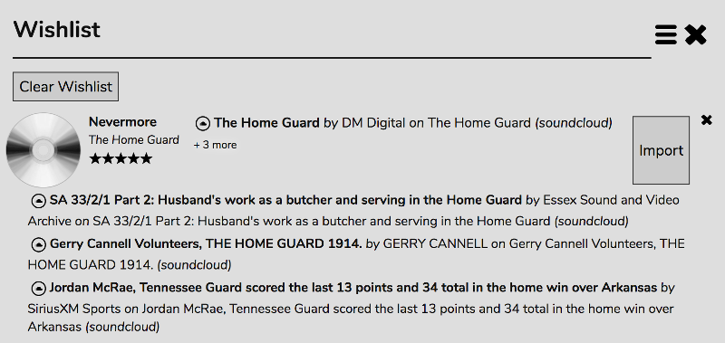

# The Wishlist

The wishlist is a means of keeping track of songs you heard on the radio that you liked.

When listening to internet radio, if you hear a song you like you can give it a rating or a tag. If you're using RompЯ with mpd the track will be added to your wishlist. If you're running Mopidy with Mopidy-Spotify and/or Mopidy-GMusic, RompЯ will first search Spotify and/or Google Music for the track and will add it directly into your collection if it finds it, or to the Wishlist if it doesn't.

The wishlist Viewer show the tracks in your Wishlist along with the ratings and tags you assigned them, the date they were added, and which Radio Station you were listening to at the time. You can play the radio station by clicking on its name.

For mpd users, the Wishlist is an *aide-memoire* only.

For mopidy users who are running other internet-based backends (eg Soundcloud, Internet Archive, YouTube) the Wishlist allows you to search those too. Click the Magnifying Glass icon next to the track you want to search for. RompЯ will search, using Mopidy and all its backends, and come back with a list of suggestions. The one that most closely matches the title and artist will be displayed.

If that's the correct track, click the Import button. If RompЯ found more than one possibility, it will display '+3 more' (or whatever number). Clicking on that will expand the entry to show all the possible matches returned by the Mopidy search

To select a different result, just click on it. It will then be moved up to the head of the list next to the Import button. Clicking Import will then add that track to your Collection.

To remove a track from the wishlist, just click the x. The 'Clear Wishlist' button will remove all tracks from the Wishlist.
