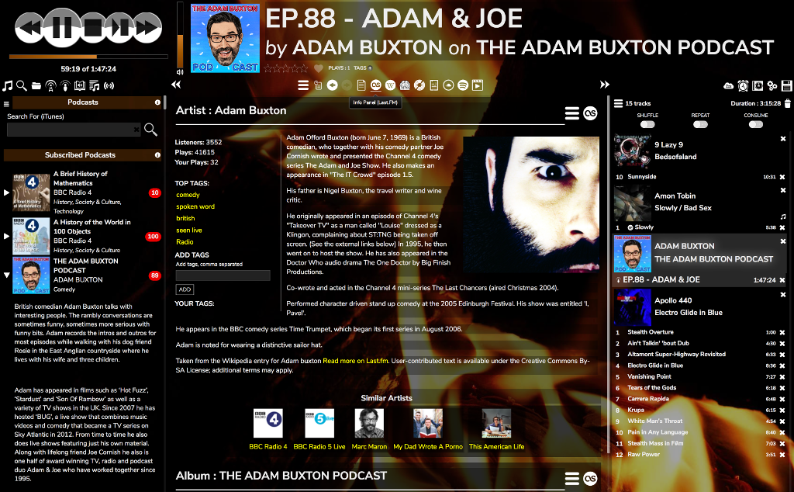
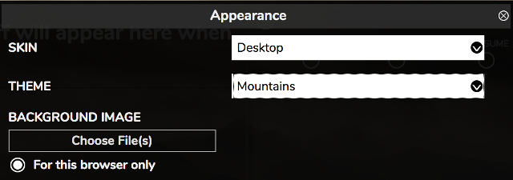
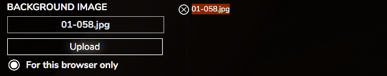

# Customising the Interface

RompЯ allows you to customise the interface with different options:
* **Theme** defines colours and background.
* **Icons** can be chosen from white, black, or colourful.
* **Font Style** allows you to pick a font. Note that some of the fonts used are taken from Google Fonts and therefore require an internet connection to work. All have sensible fallbacks, just in case.
* **Font Size** allows you to change the font size
* **Album Cover Size** changes the size of the album covers in the Music Collection and Play Queue

## Themes

Í
This is Numismatist, the default theme, using the 'Modern-Dark' icons

And this is Darkness, using the 'Modern-Light' icons

Some themes use a background image

### Custom Background Images

If you use a theme with a background image, you can change the image to one of your own from the configuration panel

Use 'Choose File(s)' to select the image then click 'Upload'.

To remove your image and revert to the default, click the x.

If you want your image to only be used in the browser you're currently using, select the option. Note that this button has no effect except when uploading images - you can't change an image to be specific to one browser after it has been uploaded, you must first remove it then upload it again.

You can choose how the image is displayed -

* Centered will centre the image within the browser window, scaling the shortest dimension so the image fills the window
* Top Left, etc will anchor the image by the spceicifed corner, scaling the shortest dimension so the image fills the window

#### Using Multiple Images

You can upload as many images as you like, to use as a slideshow.

The currently displayed image will be highlighted. If two images are highlighted, then one is landscape orientation, and one is portrait orientation (see next section)

You can also change the current background image by clicking on one of them.

#### Using different images for different orientations

If you upload multiple images, then images which are in portrait format (width < height) will only be used when the screen is also in portrait format, while images that are in landscape format (width > height) will only be used when the screen is in landscape format. In this way, if you use a mobile device, you can can have different images for different screen orientations. You can also have multiple portrait images and/or multiple landscape images and you will get a slideshow of the appropriate images for the screen orientation.

If all of your images are the same orientation, they will be used for both landscape and portrait screens.

## Setting The Theme At Load Time

You may specify a theme in the URL in your browser. Just point your browser at

    http://ip.address.of.rompr/?theme=ThemeName

where 'ThemeName' is one of the suppplied themes.

## VariableLight Theme

This theme is designed for people who use Rompr bfore they go to bed. It gets progressively darker the later the hour gets, including a nice 'sunset fade' in the evening :)

## Making Your Own Theme

You can make your own theme if you know some CSS. Just take a copy of one of the existing ones from

    rompr/themes

and edit the values. Give yours a different name, refresh the browser window, and you can select it from the menu.
