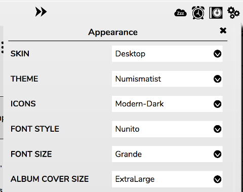
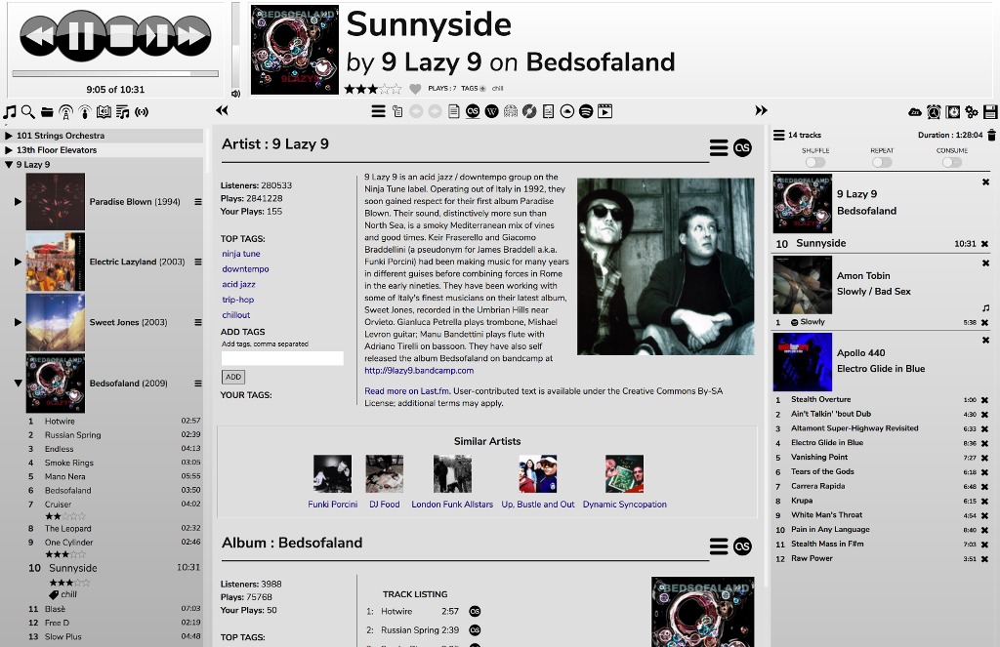
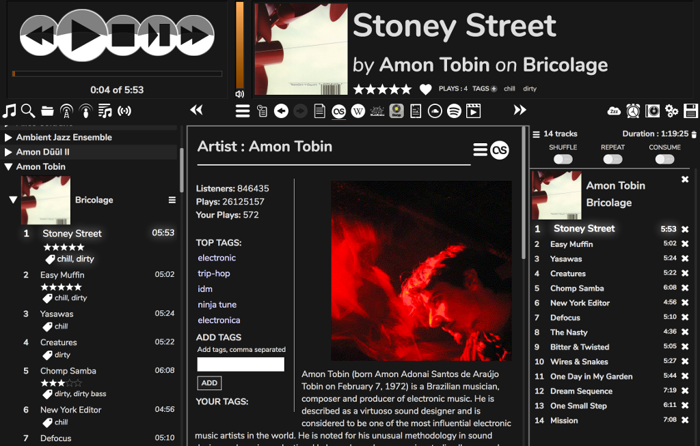
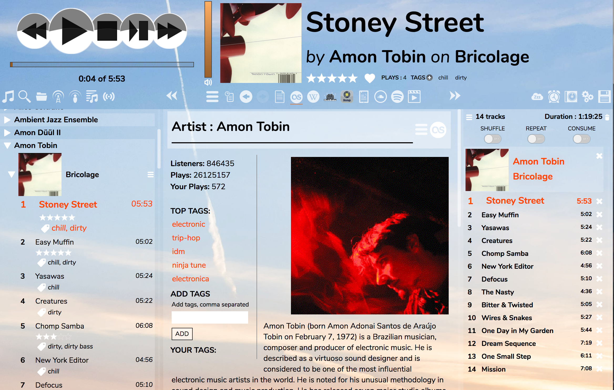
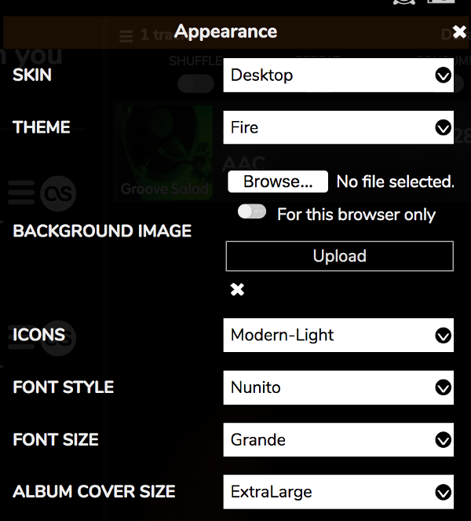

# Customising the Interface

RompЯ allows you to customise the interface with different options:
* **Theme** defines colours and background.
* **Icons** can be chosen from white, black, or colourful.
* **Font Style** allows you to pick a font. Note that some of the fonts used are taken from Google Fonts and therefore require an internet connection to work. All have sensible fallbacks, just in case.
* **Font Size** allows you to change the font size
* **Album Cover Size** changes the size of the album covers in the Music Collection and Current Playlist

## Themes

This is Numismatist, the default theme, using the 'Modern-Dark' icons

And this is Darkness, using the 'Modern-Light' icons

Some themes use a background image

If you use a theme with a background image, you can change the image to one of your own from the configuration panel

Use 'Browse' to select the image then click 'Upload'. To remove your image and revert to the default, click the x.

If you want your image to only be used in the browser you're currently using, select the option. Note that this button has no effect except when uploading images - you can't change an image to be spcific to one browser after it has been uploaded, you must first remove it then upload it again.

### Using different images for different orientations

Especially if you use a mobile device, you might want to use a different image for portrait (vertical) and landscape (horizontal) orientations. You can do this by preparing two images, the filenames must include the text '_portrait' for the portrait image, and '_landscape' for the landscape image. Eg.

    mybackground_portrait.jpg
    mybackground_landscape.jpg
    
Upload both of them one after the other. Or you can even just use one, and the default image will be used for the other orientation.

## Setting The Theme At Load Time

You may specify a theme in the URL in your browser. Just point your browser at

    http://ip.address.of.rompr/?theme=ThemeName
    
where 'ThemeName' is one of the suppplied themes.

## Making Your Own Theme

You can make your own theme if you know some CSS. Just take a copy of one of the existing ones from

    rompr/themes
    
and edit the values. Give yours a different name, refresh the browser window, and you can select it from the menu.
