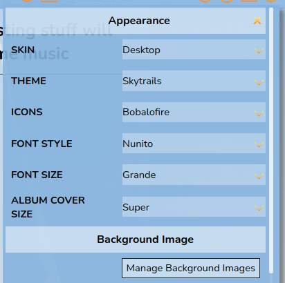
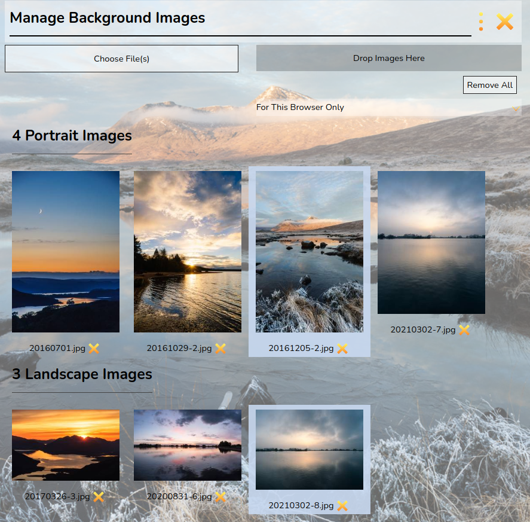
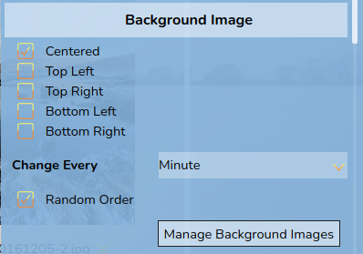

# Customising the Interface

RompЯ allows you to customise the interface with different options:
* **Theme** defines colours and background.
* **Icons** can be chosen from white, black, or colourful.
* **Font Style** allows you to pick a font. Note that some of the fonts used are taken from Google Fonts and therefore require an internet connection to work. All have sensible fallbacks, just in case.
* **Font Size** allows you to change the font size
* **Album Cover Size** changes the size of the album covers in the Music Collection and Play Queue

## Themes

This is Numismatist, the default theme, using the 'Modern-Dark' icons

And this is Darkness, using the 'Modern-Light' icons

Some themes use a background image

### Custom Background Images

If you use a theme with a background image, you can change the image to one or more of your own. There is a button in the configuration panel,
or you can use 'Manage Background Images' from the panel above the Info Panel.

This will open the Background Image Manager, from where you can upload images

Use 'Choose File(s)' to select the image then click 'Upload', or use drag-and-drop to add images.

Images can be removed by clicking the X icon next to them. Clicking an image will set it as the curent background.

If you have a mix of Portrait and Landscape images, Portrait images will only be used when the window is in portrait orientation,
and Landscape images will only be used in Landscape orienation. If you have only one format of image then they will be used for
both window orientations.

You can select an option to use the images in all browsers or only in the current browser. You can set this before you upload,
or you can change it at any time.

Multiple images will be displayed as a slide show. Once you have uploaded some images the configuration panel will allow you to set
how they appear in the browser. These options apply only to the current browser.

## Setting The Theme At Load Time

You may specify a theme in the URL in your browser. Just point your browser at

    http://ip.address.of.rompr/?theme=ThemeName

where 'ThemeName' is one of the suppplied themes.

## VariableLight Theme

This theme is designed for people who use Rompr bfore they go to bed. It gets progressively darker the later the hour gets, including a nice 'sunset fade' in the evening :)

## Making Your Own Theme

You can make your own theme if you know some CSS. Just take a copy of one of the existing ones from

    rompr/themes

and edit the values. Give yours a different name, refresh the browser window, and you can select it from the menu.
