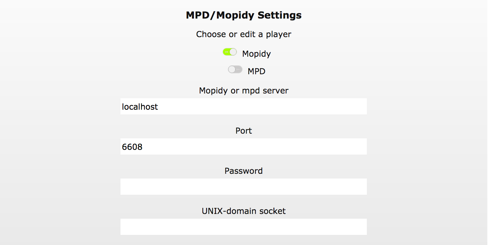
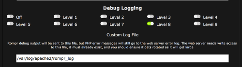

# Troubleshooting

## Cannot Connect to MPD or Mopidy

### MPD/Mopidy Addresses and Ports
In the case where your mpd/mopidy server is not running on the same PC as your apache server, or you need a password for mpd, or you'd like to use a unix-domain socket to communicate with mpd, point your browser at:

http:/ip.of.your.rompr.installation/?setup

and enter the appropriate values. This page will appear automatically if RompЯ can't communicate with mpd or Mopidy when you load the page.

### MPD on a remote PC
If you are running mpd on a different computer from your web server then you might need to change the bind_to_address in your mpd.conf as the defaults sometimes don't work. "localhost" will only accept connections from the local PC, and "any" seems to fail sometimes because it tries to bind to IPV6 first. Try:

    bind_to_address    "127.0.0.1"
    bind_to_address    "ip.address.of.this.computer"

### Mopidy on a remote PC
If Mopidy is not on the same computer as the webserver, you probably need to set

    [mpd]
    hostname = 0.0.0.0
    
in your mopidy.conf

## Web Proxy Configuration
You can configure RompЯ to use a web proxy from the setup page. Even if you have configured this in your browser you still need to confiugure RompЯ to use it too.

## Music Collection Fails To Build

### Very Large Collections

You may fall foul of web server timeouts when trying to build very large music collections. You can hopefully fix this.

Firstly, your php.ini needs to have a setting for max_execution_time. This is in seconds, so set it to something massive.

If you're using Apache and you followed the Apache instructions on here, you can set this as a php_admin_value in rompr.conf

If you're using nginx you must edit your php.ini and restart php-fpm.

Secondly you need to allow the server to wait a long time for output. With nginx, this is the fastcgi_read_timeout parameter that is in the example configuration. For Apache you need to change the Timeout directive in your apache config file. Note this has to be globally for whole server, which is another good reason to use nginx :)

## Debug Logging
You can enable debug logging from the Setup page.

If you're reporting a bug, adding a debug log is very helpful. Level 7 is usually sufficient information.

By default the debug log is the web server's error log - eg

    /var/log/apache2/error.log
    
or

    /var/log/nginx/error_log
    
(Names and locations may vary depending on your distribution)

If you're reporting a bug then this is the most useful type of log to send as it contains RompЯ's log trace as well as any PHP error messages.

The option to use a custom log file makes rompr's trace look neater when you're 'tail'-ing it in real time in a terminal but you shouldn't use this option for bug reporting as it does not contain any PHP error messages.

As well as the webserver error log, RompЯ will also output a debug trace to the web browser's error console. This could be useful in certain circumstances for reporting bugs but it's mainly intended for development purposes.

As web server error logs can get massive, the suggested method for creating a log for bug reporting is to enable debug logging first then open a terminal and then do

    tail -f /var/log/apache2/error.log > logtrace.txt
  
from a terminal. (Change the file you're tail-ing depending on your webserver) Reproduce the bug and then hit Control-C in the terminal and use the contents of logtrace.txt in your bug report.
