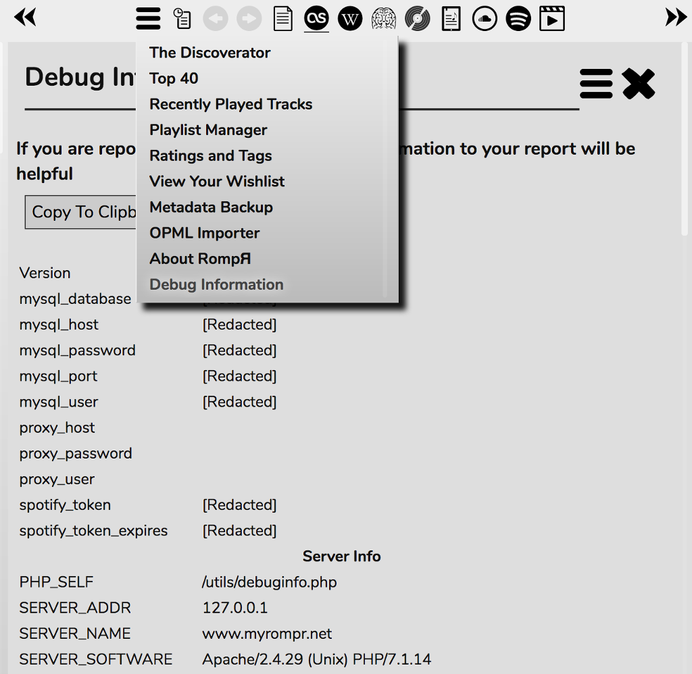

# Troubleshooting

## Cannot Connect to MPD or Mopidy

### MPD/Mopidy Addresses and Ports

In the case where your mpd/mopidy server is not running on the same PC as your webserver, or you need a password for mpd, or you'd like to use a unix-domain socket to communicate with mpd, point your browser at:

    http:/ip.of.your.rompr.installation/?setup

and enter the appropriate values. This page will appear automatically if RompЯ can't communicate with mpd or Mopidy when you load the page.

If you have already defined [Multiple Players](/RompR/Using-Multiple-Players) then you can choose one here and edit its values if you need to.

### MPD on a remote PC

If you are running mpd on a different computer from your web server then you might need to change the bind_to_address in your mpd.conf as the defaults sometimes don't work. "localhost" will only accept connections from the local PC, and "any" seems to fail sometimes because it tries to bind to IPV6 first. Try:

    bind_to_address    "127.0.0.1"
    bind_to_address    "ip.address.of.this.computer"

### Mopidy on a remote PC

If Mopidy is not on the same computer as the webserver, you probably need to set

    [mpd]
    hostname = 0.0.0.0

in your mopidy.conf

## Connection errors or other strange behaviour

MPD and Mopidy both have a connection timeout parameter, after which time they will drop the connection between them and Rompr. This is seriously bad news for Rompr. You should make sure you increase it.

### For Mopidy

In mopidy.conf, your mpd section needs to contain

    [mpd]
    connection_timeout = 120

### For MPD

Somewhere in mpd.conf

    connection_timeout     "120"

If you have a very large music collection, the higher the number the better. It is in seconds.

## Music Collection Fails To Build

### Very Large Collections

You may fall foul of web server timeouts when trying to build very large music collections. You'll see something like this:

RompR uses a value of 30 minutes by default, which is massive and should be big enough for most people, but in the case where it isn't:

The first thing to say is that if you see this message it is quite possible the update is still continuing but your browser has timed out the request. So, in case it is, do nothing with RompR, don't play any music, don't use the UI at all. You can try to see if the update is still going by using 'top' or something similar to look for CPU usage on your webserver. Don't do anything until it finishes. Or you can just wait.

To prevent it happening again.

#### With Apache

If you're using Apache and you followed the Apache instructions on here, just edit the value of

    php_admin_value max_execution_time 1800

in the Apache configuration you created as part of the setup. The number is in seconds, 1800 is 30 minutes. Just increase the value to something huge.

You also need to change the value of

    Timeout 1800

which is in the same config file. Set it to the same value as the above parameter.

#### With nginx

If you're using nginx you must edit your php.ini, as described in the setup guide - adjust the value of

    max_execution_time

to some massive number of seconds and restart php-fpm.

You will also need to increase the value of

    fastcgi_read_timeout 1800

parameter that is in the example configuration. Set this to the same value you set max_execution_time to.

#### If it still doesn't work

If, after increasing the values above you are still getting timeout errors, then you are probably suffering from browser timeouts. In this case the update process will still be running, you should close the browser window and wait for the process to complete.

#### Things that affect the time the update takes

Several factors can affect the time the update takes

* Network speeed - if your MPD or Mopidy is on a different machine than your web server, or if you are using MySQL and your database is on a different machine than your webserver.
* Using a UNIX socket for MySQL is generally slightly faster than using a port, althought this is only possible if your web server is on the same machine as your SQL server
* The speed of the machine running your Apache server - including processor and disc

## Web Proxy Configuration

If you need to use a web proxy you will need to configure Rompr to use it. You can configure RompЯ to use a web proxy from the setup page. Even if you have configured this in your browser you still need to confiugure RompЯ to use it too.

## Album Art not working

If you're having trouble with album art not displaying, it might be that you haven't installed php-gd (it's one of the things the installation instructions asks you to install), or that your distribution's build of php-gd dosn't support many image types.

In this case you can install imagemagick to be used as a fallback when gd doesn't work

    sudo apt-get install imagemagick

or on macOS

    brew install imagemagick

Versions of Rompr prior to 1.18 always used imagemagick, but 1.18 will use gd in preference if it is installed, because it is much, much faster

## Reporting Bugs

If you think you've found a bug, please report it at the [Issue Tracker](https://github.com/fatg3erman/RompR/issues), it helps to make Rompr better.

Before reporting, make sure you know exactly how to reproduce the problem. Describe it in logical steps.

It also helps a lot if you can provide the Debug Information available from the Plugins Menu:

Use the 'Copy To Clipboard' button to copy all the info the clipboard in a nicely-formatted way, and then paste it into your bug report.

If your bug is particularly complex you may be asked to provide a debug log. Or you can include one anyway, it all helps.

## Debug Logging

You can enable debug logging from the Setup page.

If you're reporting a bug, adding a debug log is very helpful. Level 7 is usually sufficient information.

By default the debug log is the web server's error log - eg

    /var/log/apache2/error.log

or

    /var/log/nginx/error_log

(Names and locations may vary depending on your distribution)

If you're reporting a bug then this is the most useful type of log to send as it contains RompЯ's log trace as well as any PHP error messages.

The option to use a custom log file makes rompr's trace look neater when you're 'tail'-ing it in real time in a terminal but you shouldn't use this option for bug reporting as it does not contain any PHP error messages.

As web server error logs can get massive, the suggested method for creating a log for bug reporting is to enable debug logging first then open a terminal and then do

    tail -f /var/log/apache2/error.log > logtrace.txt

from a terminal. (Change the file you're tail-ing depending on your webserver) Reproduce the bug and then hit Control-C in the terminal and use the contents of logtrace.txt in your bug report.

As well as the webserver error log, RompЯ will also output a debug trace to the web browser's error console. This could be useful in certain circumstances for reporting bugs but it's mainly intended for development purposes.

### Enabling from the Console

You can enable debug logging without going to the setup page, from your browser's Javascript console. Issue the command

    debug.setLevel(level);

where 'level' is the debug level from 0 to 9. Level 0 switches logging off.

**NOTE: Debug Logging will slow Rompr down and especially may crash your browser if left enabled for long periods**
