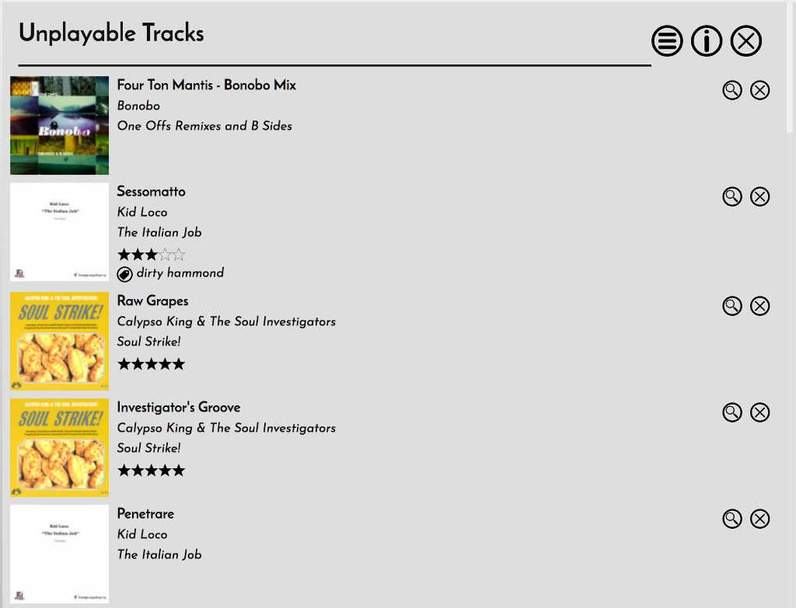
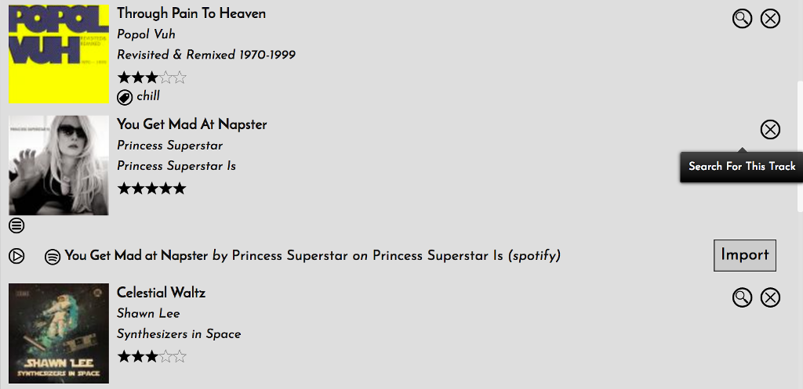

# Unplayable Tracks

If you use Mopidy with Spotify and you add Spotify tracks into your Music Collection, you may notice from time to time that some of them will no longer play. This is because Spotify has a really annoying habit of simply removing tracks from their library, and doing it in a really unhelpful way. Sometimes, bafflingly, they remove a track and replace it with an identical one, but the link to the old one no longer works. Any tracks which have been removed from Spotify but are in your Collection are then called 'Unplayable Tracks'.

If you have Spotify tracks in your Music Collection, RompR will do a regular check to make sure all of them are still playable. Sometimes it will be able to automatically repair this situation and somwtimes it won't. Any unplayable tracks that RompR can't automatically repair can be seen in the Unplayable Tracks pane

The Magnifying Glass icon will search to see if it can find this track on Spotify

As you can see here, I have an unplayable track in my collection, but Spotify have replaced it with an identical one. I think they just do it to annoy people.

You can click the Import button to add that track to your Collection. It will inherit all the Tags, Rating, and Playcount data from the Unplayable one. You can delete the Unplayable one by clicking the X.
