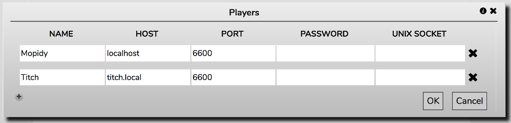
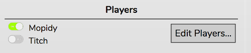

# Using Multiple Players

RompЯ supports using multiple players, which can be on different computers. You could have one in each room of your house to create a multi-room audio setup.

All the players can be used simultaneously, but they will not play in sync. The idea is that a person in one room can use one player and a person in another room can use a different player. All the players share the same Music Collection so Playcounts, Podcasts, Tags, Ratings, etc are shared across all of them.

## Defining Players

You can add new players from the configuration menu. This opens a dialog box.

Click the + icon to add a new player.

The Name can be anything that is meaningful to you.

Remember that 'localhost' in a player definition means 'the computer running the web server'.

If you're using players that are on different computers from the web server you should also read [this guide](/RompR/Troubleshooting).

## Selecting Players

To select a player to use, just select it in the Configuration menu and that browser will use it whenever you open RompЯ.

## Limitations

* All players must be the same type - i.e all MPD or all Mopidy. This is because MPD and Mopidy use different and incompatible URI schemes for files.
* Do NOT try to control multiple players from multiple tabs in the same browser. I cannot stop this or detect it and it WILL result in data corruption.
* If you're [logged in to Last.FM](/RonpR/LastFM), the same Last.FM user is used across all Players.

## Local Music Databases

If you're using local music, all players must have the same music files stored in the same directory path. The easiest way is to put your music on a network share somewhere.

Because mpd and Mopidy have to keep their own database of local music, you'll need to update this on every player when you add new music, because it needs to be kept in sync with RompЯ's collection.

With Mopidy, one solution to this is to use mopidy-local-sqlite and put the database on a network share where all the players can access it. However this can be very slow to load when you start Mopidy.

Another is to use mopidy-beets instead, with one centralised Beets server.

With mpd you can try to set the auto_update flag in mpd.conf, although I haven't been able to test whether this works on network shares.

If none of this works, you will have to use 'Update Music Collection Now' on all your Players if you add or remove local files.

## Suggested Setup

All that was rather complicated, so here's an example setup.

* One computer in room 1, running Mopidy and RompЯ.
    * Music is stored on an external USB drive which is mounted on /media/USBDrive.
    * /media/USBDrive is shared on the network
    
* Another computer in room 2, running Mopidy
    * The shared /media/USBDrive from above is mounted on /media/USBDrive
    
With this configuration, all your data is kept in sync. Further players can simply copy room 2.
