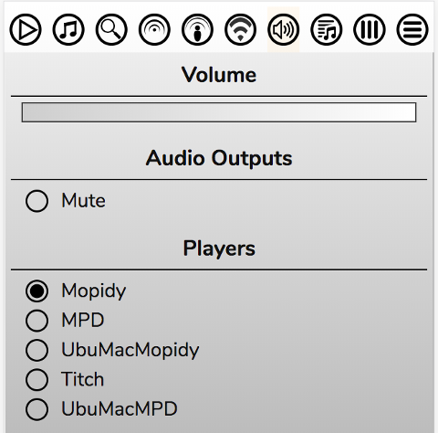

# Using Multiple Players

RompЯ supports using multiple players, which can be on different computers. You could have one in each room of your house to create a multi-room audio setup.

All the players can be used simultaneously, but they will not play in sync. The idea is that a person in one room can use one player and a person in another room can use a different player. All the players share the same Music Collection so Playcounts, Podcasts, Tags, Ratings, etc are shared across all of them.

## Multiroom Audio

If you want to have multiroom audio with all rooms playing the same music, in sync, then RompЯ has full support for controlling [Snapcast](/RompR/Snapcast)

## Defining Players

You can add new players from the configuration menu. This opens a dialog box.

Click the + icon to add a new player.

The Name can be anything that is meaningful to you.

Remember that 'localhost' in a player definition means 'the computer running the web server'.

If you're using players that are on different computers from the web server you should also read [this guide](/RompR/Troubleshooting).

## Selecting Players

To select a player to use, just select it in the Configuration menu and that browser will use it whenever you open RompЯ.

On the Phone and Tablet skins, you can also select players from the Volume Control dropdown

When switching players you will be given the option to transfer your Current Playlist to the new Player. Selecting 'Yes' will do this and playback will continue from the point where it left off.

## Limitations

* All players must be the same type - i.e all MPD or all Mopidy. This is because MPD and Mopidy use different and incompatible URI schemes for files. There is experimental support for mixing player types - see [here](#using-different -player-types)
* Do NOT try to control multiple players from multiple tabs in the same browser. I cannot stop this or detect it and it WILL result in data corruption.
* If you're [logged in to Last.FM](/RonpR/LastFM), the same Last.FM user is used across all Players.

## Local Music Databases

If you're using local music, all players must have the same music files stored in the same directory path. The easiest way is to put your music on a network share somewhere.

### With MPD

MPD's local music database must be kept in sync across all your players. With mpd you can try to set the auto_update flag in mpd.conf, although I haven't been able to test whether this works on network shares.

If this doesn't work for you, you will have to use 'Update Music Collection Now' on all your Players if you add or remove local files.

### With Mopidy

With Mopidy, one solution to this is to use mopidy-local-sqlite and put the database on a network share where all the players can access it. However this can be very slow to load when you start Mopidy.

Another is to use mopidy-beets instead, with one centralised Beets server.

However, the best solution is to use 'Slave' Mode on all but one of your Players. This relies on you having Mopidy's 'file' backend installed, which is enabled by default in all recent versions of Mopidy. The file backend does not require Mopidy's local music database, so it can be used to add local music.

#### Using Slave Mode

Decide on one Player to be your 'Master' Player. This will be the one on which you Update your Music Collection. The local files database can be stored locally on this Player, the others do not need to have access to it. You will not be allowed to update the Music Collection when using any of the Slave Players.

Then enable the 'SLAVE' option on all your other Players, as in the screenshot above.

You must also set the path to your local music files as described for [Album Art](/RompR/Album-Art-Manager).

Now when you add a local track to one of your Slave Players, Rompr will automatically use the file backend instead of the local backend. All of Rompr's other functions - including Playcounts, Tagging, and Rating - will continue to work as normal.

## Suggested Setup

All that was rather complicated, so here's an example setup.

* One computer in room 1, running Mopidy and RompЯ.
    * Music is stored on an external USB drive which is mounted on /media/USBDrive.
    * /media/USBDrive is shared on the network

* Another computer in room 2, running Mopidy
    * The shared /media/USBDrive from above is mounted on /media/USBDrive
    * This Player is configured as a Slave

* All Mopidys must have the same backends installed and configured.

With this configuration, all your data is kept in sync and all Players can play all your  music. Further players can simply copy room 2.

## Using Different Player Types

**EXPERIMENTAL AND LIMITED FEATURE. Use at your own risk**

There is now some support for mixing Mopidy and MPD. You can have some players as MPD and some as Mopidy but there are several caveats:

* This ONLY works if you are [using MySQL](/RompR/Using-a-MySQL-server). SQLite uses separate databases for MPD and Mopidy so tags, playcounts, ratings, podcasts, and radio stations will not be shared between your players if you use SQLite.
* You can only update your Music Collection when you are using the same type of player that was used to create it.
* You must be using Mopidy's 'local' (or 'local-sqlite') backend for your local files. Using 'file' is not supported.
* Obviously, attempting to add tracks from spotify, gmusic, etc to MPD will not work.
* Transferring the Current Playlist between players will work, but only if all tracks are local or streams. If the Current Playlist contains tracks that cannot be played by MPD and you switch to MPD, the results will be unpredictable.
* Any MPD players will need to keep their local music database updated. If you use a Mopidy Player to create your Music Collection (and you should), then you will need to use another MPD client for this (for example, Sonata).
* All players must have their local tracks mounted on the same path, as described above.
* Adding tracks to stored MPD playlists is not supported in this configuration
* The Tags and Ratings panel will currently not work correctly if you are using a different type of Player than the one that is used to create your Music Collection

**Supported Features**

* Playback of local files on all players
* Playback of Podcasts and Radio Stations on all players
* Transfer of local files, radio stations, and podcasts when switching players
* Tagging, Rating, and Playcounts shared across all players
* Personalised Radio (only for local files when using MPD)

