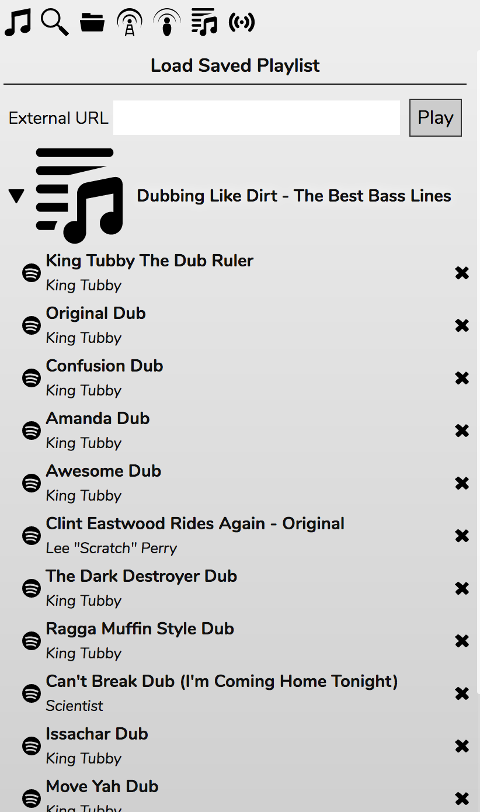
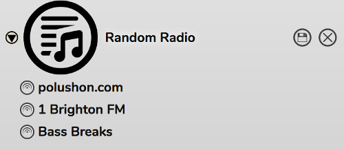
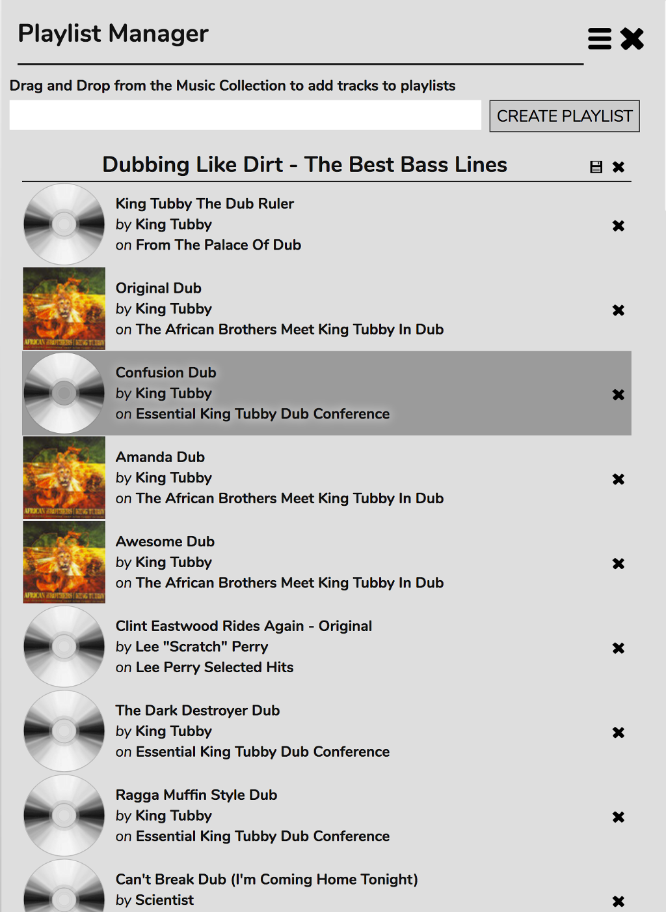
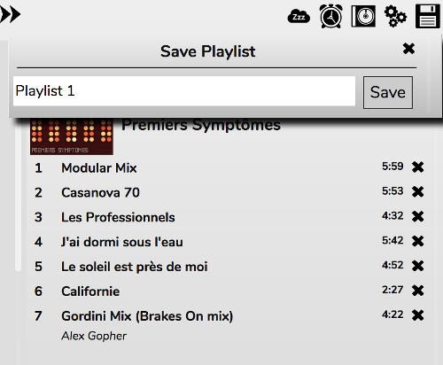

# Using Saved Playlists

RompЯ permits you to create Saved Playlists so you can create a mix and go back to it at any time.

If you use Mopidy you will be able to create new playlists, edit local ones, and view all your playlists including Spotify ones. But you will not be able to edit Spotify playlists, and creating playlists contaning a mixture of local and Spotify tracks does not always work as expected. This is because mopidy-spotify doesn't support editing playlists.

## Viewing Your Saved Playlists

The Playlists panel shows you all your saved playlists. You can open each one (as if it were an album) to view the contents. To play an entire playlist, double-click its name. You can also add individual tracks to the Current Playlist in the same way.

## Using Remote Playlists

The 'External URL' box allows you add a full URL to a playlist stored on the internet somewhere.

The remotely stored playlist can be browsed and entries from it added to the Current Playlist, or the whole playlist can be loaded as if it were local.

With mpd you can also use this to play Soundcloud tracks (see the mpd documentation).

Playlists added this way can be renamed or deleted using the icons next to the playlist name.

Playlists of all types are supported - PLS, M3U, M3U8, ASF, ASX, and XSPF

## Editing Your Saved Playlists

The Playlist Manager can be opened from the dropdown menu above the Info panel (in the top bar in the Phone skin).

You can re-order tracks in saved playlists by dragging them around. Tracks can be removed by clicking the x next to the track.

Playlists can be renamed using the floppy disc icon next to the playlist name. Playlists can be deleted using the x next to that.

Tracks can be added to Saved Palylists by dragging them from the Music Collection.

## Creating New Saved Playlists

You can create a new, empty playlist using CREATE PLAYLIST in the Playlist Manager.

You can also save the Current Playlist as a new Saved Playlist by using the floppy disc icon above the Current Playlist

If you save a playlist with the same name as an existing one the existing one will be overwritten.
