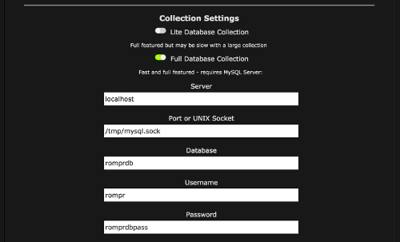

# SQL Server Configuration

By default, RompЯ uses SQLite for its database. This option requires no setup and will work for most people.

If you would like to use a MySQL server instead - perhaps because you're already running one - then you can do so.

Note that *unless you have a really good reason to use MySQL, SQLite is always better*. MySQL will not give superior performance unless you have a collection of over 100,000 tracks and even then it's marginal. Also MySQL does not, by default, support the full UTF8 character set and this may cause problems including being simply unable to add some tracks into your collection. Unless you really really know what you're doing, use SQLite.

## Install MySQL

    sudo apt-get install mysql

## Create MySQL Database

You must create the RompЯ database before you start. You will need your mysql root password.

*If you are using MySQL older than version 8*

    mysql -uroot -p
    CREATE DATABASE romprdb CHARACTER SET utf8mb4 COLLATE utf8mb4_unicode_ci;
    USE romprdb;
    GRANT ALL ON romprdb.* TO rompr@localhost IDENTIFIED BY 'romprdbpass';
    FLUSH PRIVILEGES;
    quit;

*If you are using MYSQL version 8 or later*

    mysql -uroot -p
    CREATE DATABASE romprdb CHARACTER SET utf8 COLLATE utf8_unicode_ci;
    USE romprdb;
    CREATE USER 'rompr'@'%' IDENTIFIED WITH mysql_native_password BY 'romprdbpass';    
    GRANT ALL ON romprdb.* TO rompr;
    FLUSH PRIVILEGES;
    quit;

**On Raspberry Pi** with Raspbian you need to use

    sudo mysql -uroot -p

and then enter your login password (for sudo) and then hit Enter when asked for a mysql password.

Those commands set up the RompЯ database using a default username and password. Note that any usernames and passwords you put in will be stored by RompЯ in plain text, so don't use anything important.

In the above example, the username is 'rompr' and the password is 'romprdbpass'. I suggest you change these to something else as thse are obviously published on the internet.

If your mysql server runs on a different machine than your webserver, you need to use

    GRANT ALL ON romprdb.* TO rompr@ip.address.of.webserver IDENTIFIED BY 'romprdbpass';

## Tweak MySQL

We also want to set some configuration values for mysql to increase performance. Create another file somewhere, called rompr-tweaks.cnf (note it MUST end in .cnf or it will be ignored). Put the following in it

*For MySQL older than version 8*

    [mysqld]
    query_cache_limit       = 16M
    query_cache_size        = 64M
    innodb_buffer_pool_size = 256M
    innodb_flush_log_at_trx_commit = 0

*For MySQL Version 8 or newer*

    [mysqld]
    # Only allow connections from localhost
    default_authentication_plugin = mysql_native_password
    innodb_buffer_pool_size = 256M
    innodb_flush_log_at_trx_commit = 0
    skip-log-bin

And now link this file so mysql can find it

    sudo ln -s /PATH/TO/ROMPR-TWEAKS /etc/mysql/conf.d/rompr-tweaks.cnf
    sudo ln -s /PATH/TO/ROMPR-TWEAKS /etc/mysql/mysql.conf.d/rompr-tweaks.cnf

Note that the default MySQL settings I've encountered on several distributions make MySQL significantly slower than SQLite for RompЯ, unless you have an extremely large music collection (hundreds of thousands of tracks). Setting these parameters restores the balance. Somewhat.

*NOTE* skip-log-bin is ESSENTIAL on mysql 8 or later.

## Install PHP MySQL Library

    sudo apt-get install php7.0-mysql

## Configure RompЯ

Point your web browser at

    http://your.rompr.installation/?setup

and choose the Full Database option, entering the username, password, and database name you used above as appropriate. The usual value for port is 3306. The example image below uses a UNIX socket, which is configurable in your mysql config. A UNIX socket is slightly faster but does mean that your webserver must run on the same machine as your mysql server.

