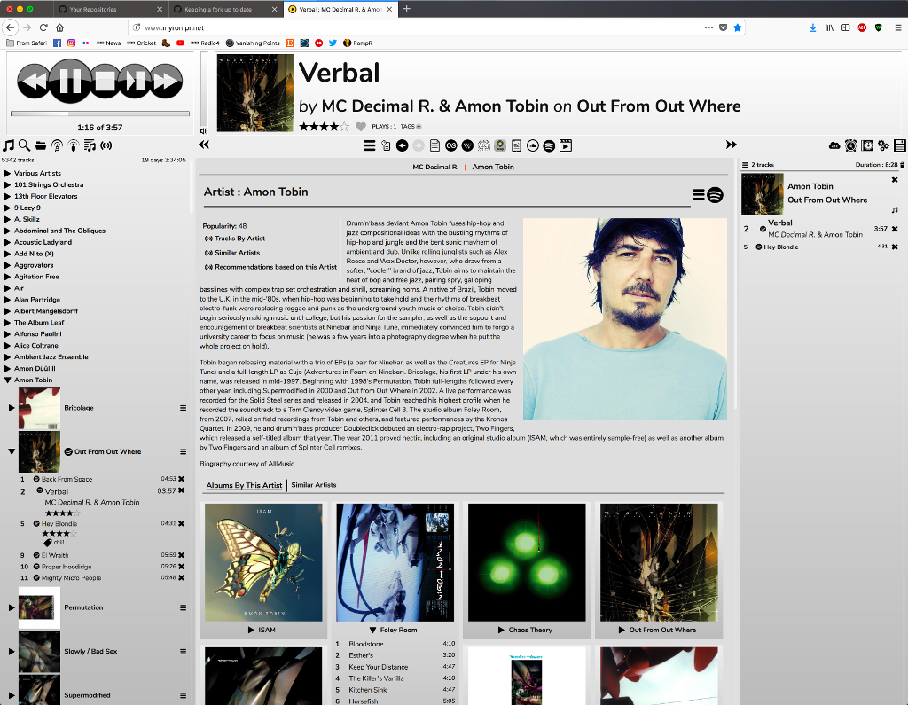
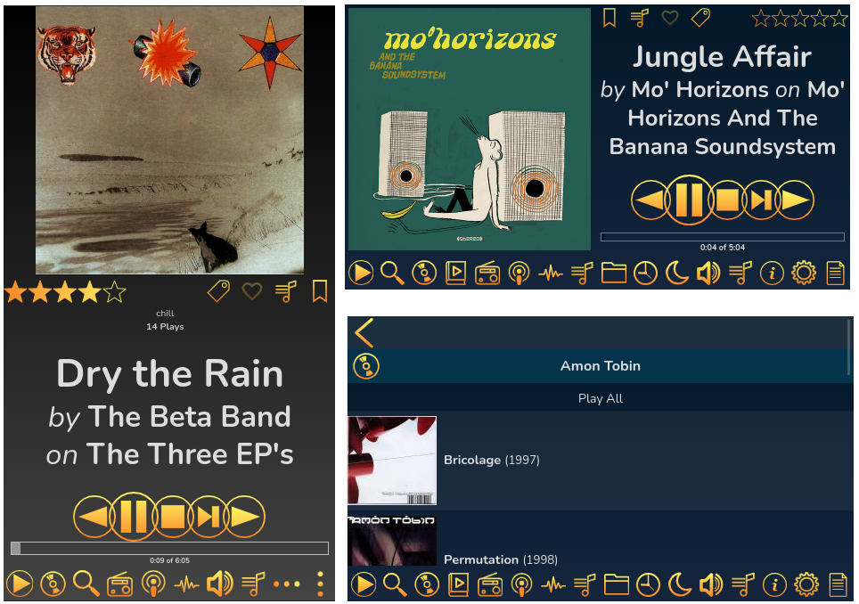

# RompЯ

RompЯ is a music player with the emphasis on discovery - discovering more about the music you know, and discovering new music you don't know yet. RompЯ is an interface that runs in a web browser on any device and controls a music player which can be on any other device. I recommend using Mopidy as the music player. When used with Mopidy and a Spotify Premium subscription RompЯ is a powerful Spotify client with many music discovery features.

## Features

* Collectioniser sorts your music by artist and album
* Directory browser
* Search
* Tagging and Rating of tracks
* Spotify, Soundcloud, GMusic, etc support (with Mopidy),
* Add tracks from Spotify, Soundcloud, etc to the collection on the fly
* Web Radio support, automatic Spotify search for radio tracks you like
* Podcast search and subscribe
* Alarm Clock
* Sleep Timer
* Album Cover Art
* Last.FM Scrobbling
* Automatic on-the-fly playlist generation based on tags, ratings, popularity, your listening habits, etc
* Get biographies of artists from various sources
* Album and artist suggestions based on your listening habits

## How to install RompЯ

Please see the links to the right of this text for installation instructions.

### RompЯ on a desktop browser

### RompЯ on a phone browser

### Music Discovery

