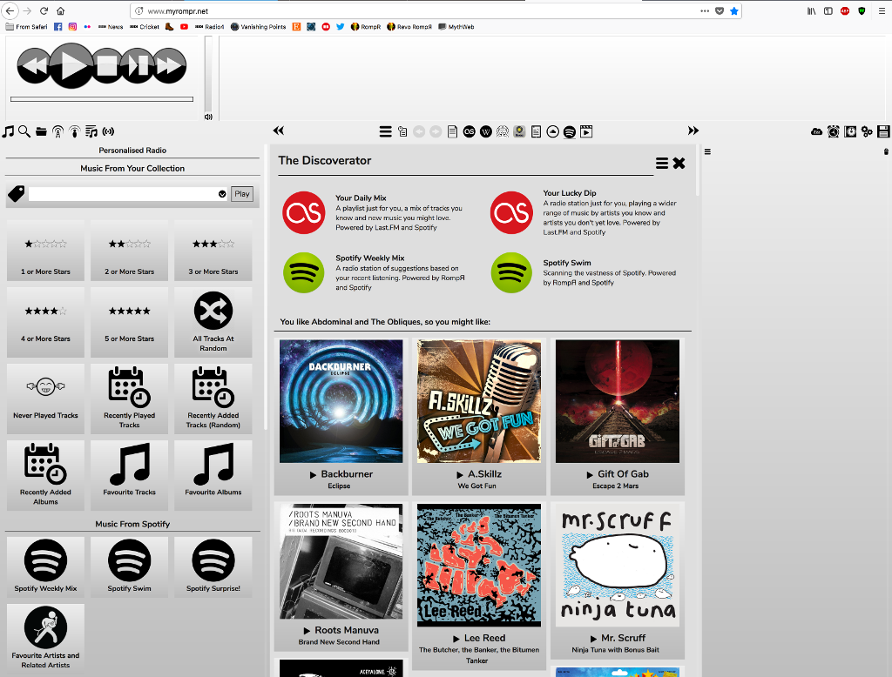

# RompЯ

RompЯ is a music player with the emphasis on discovery - discovering more about the music you know, and discovering new music you don't know yet. RompЯ is an interface that runs in a web browser on any device and controls a music player which can be on any other device. I recommend using Mopidy as the music player. When used with Mopidy and a Spotify Premium subscription RompЯ is a powerful Spotify client with many music discovery features. It also handles Podcast subscriptions, web radio, automatic playlists, and has tagging and rating features

## How to install RompЯ

[Standard installation on Linux instructions](https://fatg3erman.github.io/RompR/Recommended-Installation-on-Linux)

[Alternative Linux Installation with Apache2](https://fatg3erman.github.io/RompR/Installation-on-Linux-Alternative-Method)

If you want to download a stable release you should visit the project homepage which for want of more time to do something better is at https://sourceforge.net/projects/rompr/. There you will find a fuller wiki, a discussion forum, and installation instructions for macOS.

### RompЯ on a desktop browser

### RompЯ on a phone browser

### Music Discovery

