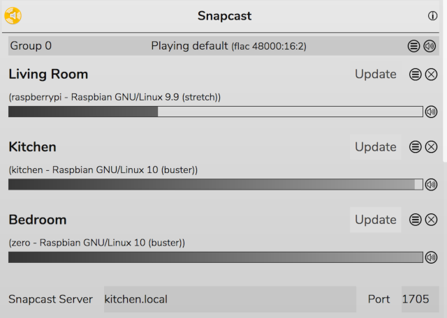
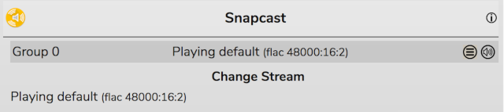

# Snapcast

[Snapcast](https://github.com/badaix/snapcast) is a system for playing synchronisde audio in multiple rooms simultaneously. Rompr contains full support for contrlling a Snapcast server.

## Configuration

Enter the hostname and port for your Snapcast server in the onfiguration panel. The panel will then update to show your Snapcast network. On the phone and tablet skins this information will appear in the volume control dropdown, underneath the Players.

Groups can be muted using the Mute icon next to the group.
Clients can be muted, removed, and have their volume adjusted. To rename a client just type over it and click the 'Update' button.

## Assigning Streams to Groups

If your Snapcast server has multiple streams, you can assign a stream to a group by using the dropdown 'hamburger' icon. Just click a stream to assign it to the group.

## Assigning Clients to Groups and Setting Client Latency

To move a client to a different group or set its latency, use the hamburger menu next to the Client

