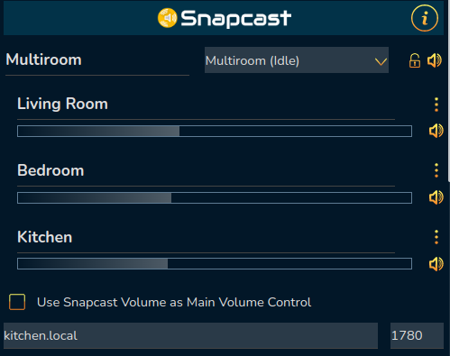
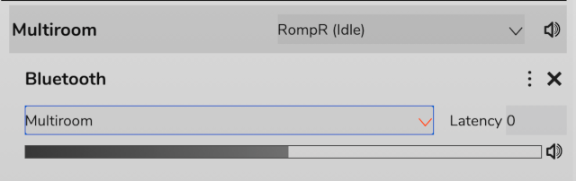
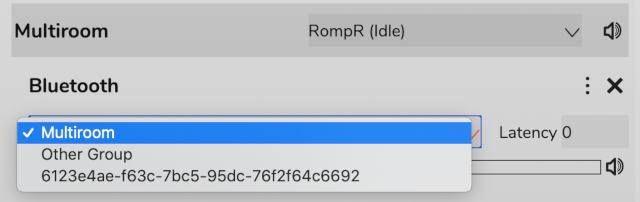

# Snapcast

[Snapcast](https://github.com/badaix/snapcast) is a system for playing synchronised audio in multiple rooms simultaneously. Rompr contains full support for contrlling a Snapcast server.

## Configuration

Enter the hostname and port for your Snapcast server in the onfiguration panel. The panel will then update to show your Snapcast network.
You should use the port for the HTTP JSON-RPC API, as defined in your snapserver.conf. By default this is enabled on port 1780.
Note that earlier versions of RompR used snapserver's TCP port but this changed in RompR version 1.51 - using the HTTP port allows multiple RompRs to update their Snapcast info simultaneously.
On the phone and tablet skins this information will appear in the volume control dropdown, underneath the Players.

The Snapcast panel shows you groups and the Clients in those groups.

Groups can be muted using the Mute icon next to the group and renamed by editing the name.

Clients can be muted, removed, renamed, and have their volume adjusted.

If your Snapcast server has multiple streams, you can assign a stream to a group by using the menu to the right of the group name

## Assigning Clients to Groups and Setting Client Latency

To move a client to a different group or set its latency, use the hamburger menu next to the Client.
Select a group from the list.

